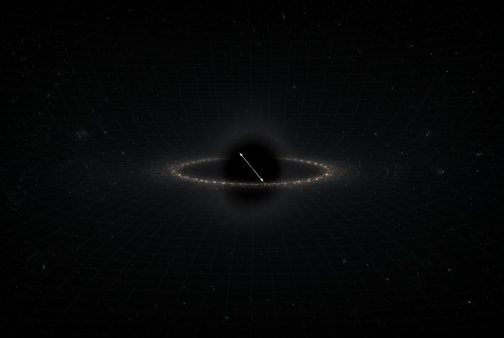

+++
title = "Is the universe infinite?"
date = 2026-10-05
author = "Hadi Lashkari Ghouchani"
summary = "A light ray climbing a short way through a rotating patch: Kerr, Myers–Perry and geodesic monism (with two new rotating solutions, one of them a three-sphere rotating along φ, not Ricci flat, with an equator, a pole and a stable orbit), equator and pole, the Hubble law of the non-Ricci-flat modes, and every step proved."
draft = false

[taxonomies]
categories = ["Physics", "Geometry", "Cosmology", "Theorem"]
tags = [
 "Kerr",
 "Myers-Perry",
 "Geodesic monism",
 "Redshift",
 "Hubble",
 "Lean",
]
+++



The question that "Is the universe infinite?" was always in my mind since I was a kid!
I was baffled by thinking that there's a wall if go directly in a direction.


<!-- more -->
-------------

After start studying Physics, and understand that there's no infinity in a real life,
I got my final answer that it's not infinite,
but the question that what will happen if I go in a direction for a long time stuck with me.
By the way, I am triggered to write this by a post in X,
where someone still had a question that if universe is infinite!
To prove it's infinite, you need to measure the curvature with infinite precision,
which also force you to have access to the infinite distance away.
Nobody will ever can do it and asking it is not a good question at all!
Good questions are the questions that have answer, and finding them is hard.

In the Geodesic monism[1](#gmono),
I already described what will happen if you move in a direction for a long time.
You will lose dimensions,
since the action of that theory allows the metric to diverge asymptotically.
But having a universe in a black hole solution of its equation requires a center for that.
Having a center would make it an obvious spot to see in the sky, right?
Thus it should not be the case.

There is also the oldest clue of all: the sky is dark at night.
If space were infinite and filled with stars, and the light of a star fell off only as \\( 1/r^2 \\),
every shell of stars would add as much light as the one before it, and the whole sky would shine as bright as a star.
This is Olbers's paradox.
In geodesic monism the solutions are not Ricci flat, and far away you lose dimensions,
so the \\( 1/r^2 \\) law does not hold there:
the light from far away arrives redshifted, with less energy and less often, and the far shells fade instead of adding up.
That is why the background of the sky is dark, and it is the first answer this post gives to the question in its title
(Theorem 18 and Corollary 20).

Given that the current measurement of the curvature excludes the patch of our observable universe to live on any rotational solution that its radius is smaller than multiple size of the patch,
here we are seeking any evidence, or semi-evidence, to support such a solution.

The plan is short to state. Put the observable universe in a small patch of a rotating metric, far from its centre. Send a light ray a short horizontal distance across the patch while it climbs a little. Climbing costs the light energy, so it arrives redshifted. Compute that redshift for four rotating metrics, in a patch on the equator and in a patch at the pole, and ask the supernova catalogues what they say about it. Two new solutions of geodesic monism come with it: the general rotating dipole in 1 + 4 dimensions, and a three-sphere rotating along \\( \phi \\) in 1 + 1 + 4, with a stable orbit that geodesics leave only through its rotation axis. Every equation below is proved in the text, and every algebraic step is checked by Lean or by SymPy; the code is in the appendices and in its repository[2](#code).

# Flat, up to the error

Spatial curvature is reported as \\( \Omega\_K \\). Planck 2018 temperature, polarisation and lensing combined with baryon acoustic oscillations give

\\[
\Omega\_K = 0.0007 \pm 0.0019,
\\]

consistent with a flat background inside that bar.[3](#planck) The local distance ladder gives \\( H\_0 = 73.04 \pm 1.04 \\, \mathrm{km\\,s^{-1}\\,Mpc^{-1}} \\).[4](#shoes) Infinity is not settled by that bar, and a curved background whose scale is many times the size of the patch is not excluded by it either. That is the room this post uses.

# The setting

**The regime.** Fix an observer at radius \\( r \\) and colatitude \\( \theta\_O \\) of a stationary, axisymmetric metric. The emitter sits at \\( (r - \delta r,\\, \theta\_O - \Delta\theta,\\, \phi - \Delta\phi) \\), and the two are joined by a null geodesic. We ask for

\\[
a \neq 0, \quad \Delta\theta \neq 0, \quad \Delta\phi \neq 0, \quad \delta r \neq 0, \qquad r \gg \Delta x \gg \delta r .
\\]

The ray mostly runs sideways and climbs a little. The two patches are

\\[
\text{equator:}\\ \theta\_O = \frac{\pi}{2} + \vartheta, \qquad \text{pole:}\\ \theta\_O = \vartheta ,
\\]

where \\( \vartheta \\) is the observer's own offset from the centre of the patch.

**The local coordinates.** The observer describes the horizontal part of the step with two local coordinates, its proper length \\( \Delta x \\) and its angle \\( \gamma \\) from the direction of rotation \\( \hat e\_\phi \\), measured towards \\( \hat e\_\theta \\):

\\[
(\Delta x)^2 = g\_{\theta\theta}(\Delta\theta)^2 + g\_{\phi\phi}(\Delta\phi)^2, \qquad
\sqrt{g\_{\phi\phi}}\\,\Delta\phi = \Delta x\cos\gamma, \qquad \sqrt{g\_{\theta\theta}}\\,\Delta\theta = \Delta x\sin\gamma .
\\]

The step points from the emitter to the observer, the way the light travels. Near the pole, where \\( \phi \\) is the angle around the axis, the same \\( \Delta x \\) and \\( \gamma \\) are read in the flat tangent plane, \\( P = \ell\\,\theta\\,(\cos\phi, \sin\phi) \\). Throughout, \\( \ell = \sqrt{g\_{\theta\theta}} \\) at the centre of the patch is the proper length of one radian of \\( \theta \\). The aim is \\( z \\) as a function of \\( \Delta x \\) and \\( \gamma \\), with the climb \\( \delta r \\) as the remaining small parameter.

**Power counting.** Write \\( \varepsilon = \Delta x / r \\). The regime is counted as

\\[
\frac{\Delta x}{\ell},\\ \vartheta \sim \varepsilon, \qquad \frac{\delta r}{r} \sim \varepsilon^2,
\\]

which is exactly "\\( \delta r / \Delta x \sim \varepsilon \ll 1 \\)". Every result below is expanded to order \\( \varepsilon^2 \\), the first order where \\( \delta r \\) and \\( (\Delta x)^2 \\) compete.

**The clock and the observers.** The metrics have a timelike Killing vector \\( \xi \\) (the clock) and an axial Killing vector \\( \partial\_\phi \\). Two families of observers are natural, and the answer depends on which one is used, so both are carried along:

\\[
\text{static:}\\ U = \frac{\xi}{\alpha}, \quad \alpha^2 = -g(\xi,\xi); \qquad
\text{ZAMO:}\\ U = \frac{\xi + \omega\\,\partial\_\phi}{N}, \quad \omega = -\frac{g(\xi,\partial\_\phi)}{g\_{\phi\phi}}, \quad N^2 = -g(\xi,\xi) + \frac{g(\xi,\partial\_\phi)^2}{g\_{\phi\phi}} .
\\]

The ZAMOs are the zero-angular-momentum observers of Bardeen, Press and Teukolsky.[5](#bpt) They are dragged by the rotation; the static ones are held against it. The four-velocity is written \\( U \\) throughout, because \\( u \\) is a coordinate in geodesic monism.

# Light is a bundle of null geodesics

Before any calculation, here is what is being calculated, because it is where this post parts ways with the usual presentation.

Light is not one ray carrying an arrow. It is a bundle of null geodesics, and what light carries from the emitter to the observer is the relative separation between neighbouring geodesics of that bundle. The tangent \\( k \\) of a ray only says which way the bundle points; it carries nothing. Two neighbouring rays, emitted one crest apart, carry the period: the period is the length of the timelike vector that separates them. The same two rays carry the wavelength as the length of a spacelike vector that separates them. The wavelength is not needed in this post, but it completes the picture.

The separation vector \\( \eta \\) between two rays is carried along the bundle by Lie transport,

\\[
\mathcal{L}\_k \eta = [k, \eta] = 0,
\\]

because \\( \eta \\) is not an arrow chosen once and pushed along by a rule; it joins the same two rays at every point, so its flow along \\( k \\) is fixed by the bundle itself. This is the statement that \\( \eta \\) is a geodesic-deviation vector. In geodesic monism, geodesics are the ontological basis, so this reading is forced there. But nothing in it uses geodesic monism: it is the right reading of light in every theory built on General Relativity, and it is the one used for all four metrics below.

**Theorem 1 (Lie transport changes the length).** *If \\( \mathcal{L}\_k\eta = 0 \\) along a bundle of geodesics with tangent \\( k \\), then*

\\[
\frac{d}{d\lambda}\\, g\_{ab}\eta^a\eta^b = 2\\, \eta^a\eta^b\\, \nabla\_a k\_b .
\\]

*Proof.* \\( \mathcal{L}\_k \eta = 0 \\) means \\( k^b\nabla\_b\eta^a = \eta^b\nabla\_b k^a \\) (the connection is torsion free). Then \\( \frac{d}{d\lambda}(\eta\cdot\eta) = 2\eta\_a k^b\nabla\_b\eta^a = 2\eta\_a\eta^b\nabla\_b k^a \\). ∎

The length changes exactly as much as the bundle is sheared or expanded along \\( \eta \\). That is the redshift.

**Lemma 2 (what the bundle conserves).** *Let \\( \eta \\) be Lie transported along a bundle of null geodesics. Then \\( k\cdot\eta \\) is constant along the bundle, and it does not change under \\( \eta \to \eta + f k \\).*

*Proof.* \\( \frac{d}{d\lambda}(k\_a\eta^a) = \eta^a k^b\nabla\_b k\_a + k\_a k^b\nabla\_b\eta^a \\). The first term vanishes because the rays are geodesics. In the second, use \\( k^b\nabla\_b\eta^a = \eta^b\nabla\_b k^a \\) to get \\( k\_a\eta^b\nabla\_b k^a = \tfrac12\eta^b\nabla\_b(k\cdot k) = 0 \\), because every ray of the bundle is null. Finally \\( k\cdot(\eta + fk) = k\cdot\eta \\) since \\( k\cdot k = 0 \\). ∎

The second half of the lemma is the one freedom left. \\( \eta \\) and \\( \eta + fk \\) join the same two rays, at points slid along them. The period an observer reads is the separation taken along the observer's own worldline, \\( \eta = \tau\\, U \\), and that choice removes the freedom.

**Theorem 3 (the period ratio).** *Let \\( \eta\_E = \tau\_i\\, U\_E \\) be the separation of two neighbouring rays along the emitter's worldline, and \\( \eta\_O = \tau\_f\\, U\_O \\) the separation of the same two rays along the observer's worldline. Then*

\\[
1 + z \equiv \frac{\tau\_f}{\tau\_i} = \frac{(k\cdot U)\_E}{(k\cdot U)\_O} .
\\]

*Proof.* \\( \eta\_O \\) is the Lie transport of \\( \eta\_E \\) slid along the second ray, \\( \eta\_O = \eta\_E^{\text{transported}} + fk \\). By Lemma 2, \\( k\cdot\eta\_E = k\cdot\eta\_O \\), that is \\( \tau\_i (k\cdot U)\_E = \tau\_f (k\cdot U)\_O \\). ∎

**Corollary 4 (the wavelength).** *The spacelike separation of the same two rays orthogonal to \\( U\_O \\) has length \\( \lambda\_f = c\\, \tau\_f \\).*

*Proof.* Take \\( \eta' = \tau\_f U\_O + fk \\) with \\( U\_O\cdot\eta' = 0 \\), so \\( f = \tau\_f/(U\_O\cdot k) \\). Then \\( \eta'\cdot\eta' = -\tau\_f^2 + 2f\tau\_f (U\_O\cdot k) = \tau\_f^2 \\). ∎

So period and wavelength are two lengths of the same separation, read in two directions, and they redshift together.

**Proposition 5 (stationary bundles).** *Let \\( \xi \\) be the clock (a timelike Killing vector) and \\( \partial\_\phi \\) the axial Killing vector, with \\( E = -k\cdot\xi \\), \\( L = k\cdot\partial\_\phi \\) and \\( b = L/E \\) constant on each ray. Then*

\\[
\text{static:}\\ 1 + z = \frac{\alpha\_O}{\alpha\_E}, \qquad
\text{ZAMO:}\\ 1 + z = \frac{N\_O}{N\_E}\\,\frac{1 - \omega\_E b}{1 - \omega\_O b} .
\\]

*For static observers the period is literally the length of a Lie-transported timelike vector: \\( \eta = \Delta t\\, \xi \\) along the whole bundle, so \\( \tau\_i = \alpha\_E\Delta t \\) and \\( \tau\_f = \alpha\_O\Delta t \\). For the ZAMO, \\( b/(1 - \omega\_E b) = \sqrt{g\_{\phi\phi}}\\, n\_\phi/N \\) at the emitter, where \\( n\_\phi \\) is the cosine between the photon direction and \\( \partial\_\phi \\) in the emitter's ZAMO frame.*

*Proof.* In a stationary metric the second crest's bundle is the first one moved by the time translation, so \\( [k,\xi] = 0 \\) and \\( \eta = \Delta t\\,\xi \\) is Lie transported. \\( \xi \\) is along the static worldlines at both ends, and its length is \\( \alpha \\). For the ZAMO use Theorem 3: \\( -k\cdot U = (E - \omega L)/N \\), with \\( E \\) and \\( L \\) constant because \\( k^b\nabla\_b(k\cdot\xi) = k^ak^b\nabla\_{(a}\xi\_{b)} = 0 \\), and the same for \\( \partial\_\phi \\). In the ZAMO frame the photon has energy \\( \epsilon = (E - \omega L)/N \\) and \\( \phi \\)-momentum \\( L/\sqrt{g\_{\phi\phi}} = \epsilon\\, n\_\phi \\), which gives the last formula. ∎

Appendix B checks this without using any formula. For each metric, patch and observer it shoots two neighbouring null geodesics. The first leaves the emitter and reaches the observer. The second leaves the emitter's worldline a proper time \\( \tau\_i \\) later and is aimed so that it lands on the observer's worldline. The script then reads \\( \tau\_f \\) on that worldline. In all twelve cases \\( \tau\_f/\tau\_i \\) agrees with Proposition 5 to a relative \\( 10^{-5} \\), the precision of the aiming.

# The redshift in the local coordinates

**Proposition 6 (\\( z \\) as a function of \\( \Delta x \\) and \\( \gamma \\)).** *In the regime above,*

\\[
z(\Delta x, \gamma) \= C\_r\\, \delta r + C\_\theta\\, q(\Delta x, \gamma) + \cos\gamma \left\[ D\_r\\, \delta r + D\_\theta\\, q(\Delta x, \gamma) \right\] + O(\varepsilon^3),
\\]

\\[
q(\Delta x, \gamma) = \frac{\vartheta}{\ell}\\,\Delta x\sin\gamma - \frac{(\Delta x)^2}{2\ell^2}\\, s(\gamma), \qquad
s(\gamma) = \begin{cases} \sin^2\gamma & \text{equator} \\\\ 1 & \text{pole} \end{cases}
\\]

*with, at the centre of the patch,*

\\[
\text{static:}\\ C\_r = \partial\_r \ln \alpha, \quad C\_\theta = \partial\_\theta^2 \ln \alpha, \quad D = 0; \qquad
\text{ZAMO:}\\ C\_r = \partial\_r \ln N, \quad C\_\theta = \partial\_\theta^2 \ln N, \quad D\_r = \sqrt{\frac{g\_{\phi\phi}}{N^2}}\\, \partial\_r \omega, \quad D\_\theta = \sqrt{\frac{g\_{\phi\phi}}{N^2}}\\, \partial\_\theta^2 \omega .
\\]

*At the pole \\( D\_r = D\_\theta = 0 \\) at this order.*

Written out for the two patches:

\\[
\text{equator:}\quad z = C\_r\\,\delta r + \frac{C\_\theta\vartheta}{\ell}\\,\Delta x\sin\gamma - \frac{C\_\theta}{2\ell^2}(\Delta x)^2\sin^2\gamma + \cos\gamma\left[ D\_r\\,\delta r + \frac{D\_\theta\vartheta}{\ell}\\,\Delta x\sin\gamma - \frac{D\_\theta}{2\ell^2}(\Delta x)^2\sin^2\gamma \right],
\\]

\\[
\text{pole:}\quad z = C\_r\\,\delta r + \frac{C\_\theta\vartheta}{\ell}\\,\Delta x\sin\gamma - \frac{C\_\theta}{2\ell^2}(\Delta x)^2 .
\\]

*Proof.* Taylor expand \\( F = \ln \alpha^2 \\) about the observer: \\( F(O) - F(E) = \Delta\theta\\, F\_\theta + \delta r\\, F\_r + (\vartheta \Delta\theta - \tfrac12 \Delta\theta^2) F\_{\theta\theta} + O(\varepsilon^3) \\); the terms \\( \delta r\\, \Delta\theta \\) and \\( \delta r^2 \\) are \\( O(\varepsilon^3) \\) and \\( O(\varepsilon^4) \\). The metrics are invariant under \\( \theta \to \pi - \theta \\), so every \\( \theta \\)-derivative of odd order vanishes on the equator, and they are smooth functions of \\( \cos\theta \\) at the axis, so \\( \partial\_\theta = -\sin\theta\\, \partial\_{\cos\theta} \\) vanishes there. This kills \\( F\_\theta \\) in both patches, so \\( \ln(1+z) = z + O(\varepsilon^4) \\), and nothing depends on \\( \phi \\). On the equator \\( \Delta\theta = \Delta x\sin\gamma/\ell \\), which turns \\( \vartheta\Delta\theta - \tfrac12\Delta\theta^2 \\) into \\( q \\) with \\( s = \sin^2\gamma \\). At the pole the \\( \theta \\)-dependence enters through \\( \theta^2 = |P|^2/\ell^2 \\), and \\( F(O) - F(E) \\) carries \\( \tfrac12(\theta\_O^2 - \theta\_E^2)F\_{\theta\theta} \\). With \\( P\_E = P\_O - \Delta\vec x \\) and \\( P\_O\cdot\Delta\vec x = \ell\vartheta\\,\Delta x\sin\gamma \\) (the component of the step along \\( \hat e\_\theta \\), which points away from the axis), \\( \tfrac12(\theta\_O^2 - \theta\_E^2) = (2P\_O\cdot\Delta\vec x - \Delta x^2)/(2\ell^2) = q \\) with \\( s = 1 \\). For the ZAMO the extra factor of Proposition 5 is \\( \ln(1 - \omega\_E b) - \ln(1 - \omega\_O b) = \frac{b}{1 - \omega\_E b}(\omega\_O - \omega\_E) + O((\Delta\omega)^2) \\), with \\( \omega\_\theta = 0 \\) in both patches, and \\( \omega\_O - \omega\_E \\) expands like \\( F \\). The ray is horizontal up to \\( O(\varepsilon) \\), so \\( n\_\phi = \cos\gamma + O(\varepsilon) \\), and the correction is \\( O(\varepsilon^3) \\). At the pole \\( \sqrt{g\_{\phi\phi}} \propto \sin\theta = O(\varepsilon) \\), so the cross term is \\( O(\varepsilon^3) \\). ∎

So the horizontal step enters in three ways only:

- **Linear in \\( \Delta x \\)**, as \\( \sin\gamma \\), and only when the observer sits off the centre of the patch (\\( \vartheta \neq 0 \\)).
- **Quadratic in \\( \Delta x \\)**, as \\( \sin^2\gamma \\) on the equator and isotropically at the pole. This is how the two patches differ in the sky.
- **Through the rotation**, as \\( \cos\gamma \\), and only for ZAMOs on the equator.

A step along the rotation (\\( \gamma = 0 \\)) at fixed \\( r \\) gives no redshift for static observers, and none for ZAMOs unless the ray also climbs.

Appendix B checks Proposition 6 against Proposition 5 on numerically integrated rays. \\( \Delta x \\) and \\( \gamma \\) are read off the endpoints. Halving \\( \Delta x \\) and quartering \\( \delta r \\) shrinks the difference by \\( 8 \\) or more in every case (by \\( 16 \\) on the equator, where the reflection symmetry also removes the \\( \varepsilon^3 \\) term).

**Corollary 7 (leading order in the horizontal regime).** *Factor \\( \Delta x \\) out of Proposition 6:*

\\[
z = \Delta x\left[ C\_r\frac{\delta r}{\Delta x} + \frac{C\_\theta\vartheta}{\ell}\sin\gamma - \frac{C\_\theta\\,\Delta x}{2\ell^2}s(\gamma) + \cos\gamma\left( D\_r\frac{\delta r}{\Delta x} + \frac{D\_\theta\vartheta}{\ell}\sin\gamma - \frac{D\_\theta\\,\Delta x}{2\ell^2}s(\gamma) \right) \right].
\\]

*The climb enters as \\( \delta r/\Delta x \sim \varepsilon \\), so the \\( C\_r \\) and \\( D\_r \\) terms drop. On the equator the observer's offset is larger than the step angle, \\( \vartheta \gg \Delta x/\ell \\), so the \\( (\Delta x)^2 \\) terms drop too. At the pole the observer is within a step of the axis, \\( \vartheta \sim \Delta x/\ell \\), and they stay. What is left is*

\\[
\text{equator:}\quad z \simeq \frac{\vartheta}{\ell}\\,\Delta x\sin\gamma\\,\bigl(C\_\theta + D\_\theta\cos\gamma\bigr), \qquad
\text{pole:}\quad z \simeq \frac{C\_\theta}{\ell}\\,\Delta x\left(\vartheta\sin\gamma - \frac{\Delta x}{2\ell}\right).
\\]

*The \\( C\_r \\) term is negligible when \\( |C\_r|\\,\delta r \ll |C\_\theta|\\,\vartheta\\,\Delta x/\ell \\), that is \\( \delta r/\Delta x \ll |C\_\theta|\vartheta/(|C\_r|\ell) \\), and likewise for \\( D\_r \\) against \\( D\_\theta \\). This is about \\( 2(a/r)^2\vartheta \\) in Kerr and \\( (a/r)^2\vartheta \\) in Myers–Perry. In geodesic monism it holds whenever the observer sits near the stationary point of \\( H\_0 \\), where \\( C\_r \to 0 \\).*

*Proof.* Each dropped term is the kept term of the same bracket multiplied by a ratio that the regime makes small: \\( (C\_r\\,\delta r/\Delta x)/(C\_\theta\vartheta/\ell) \\) by the condition above, and \\( (\Delta x/2\ell^2)/(\vartheta/\ell) = \Delta x/(2\ell\vartheta) \\) on the equator. ∎

At leading order the horizontal redshift is carried by \\( C\_\theta \\) and \\( D\_\theta \\), and in Kerr and Myers–Perry both vanish without rotation: \\( C\_\theta \propto a^2 \\) and \\( D\_\theta \propto a^3 \\). On the equator their ratio carries the spin itself, \\( D\_\theta/C\_\theta = -2a\sqrt{\Delta}/(r^2 + a^2) \simeq -2a/r \\) in Kerr (the same form with \\( r^2 + a^2 - \mu \\) under the root in Myers–Perry). In geodesic monism it is \\( 0 \\). For a static observer \\( C\_\theta\vartheta/\ell = \partial\_\theta\ln\alpha/\ell \\) at the observer, so \\( c^2 C\_\theta\vartheta/\ell \\) is the observer's own proper acceleration along \\( \hat e\_\theta \\).

# Kerr

## The metric

Boyer–Lindquist, \\( G = c = 1 \\), \\( \rho^2 = r^2 + a^2\cos^2\theta \\), \\( \Delta = r^2 - 2Mr + a^2 \\), clock \\( \xi = \partial\_t \\):

\\[
g\_{tt} = -\left(1 - \frac{2Mr}{\rho^2}\right), \qquad g\_{t\phi} = -\frac{2Mar\sin^2\theta}{\rho^2}, \qquad g\_{\phi\phi} = \left(r^2 + a^2 + \frac{2Ma^2 r \sin^2\theta}{\rho^2}\right)\sin^2\theta .
\\]

On the axis \\( g\_{t\phi} = g\_{\phi\phi} = 0 \\), and \\( N^2 = \Delta\rho^2 / ((r^2+a^2)\rho^2 + 2Ma^2 r \sin^2\theta) \\), \\( \omega = 2Mar / ((r^2+a^2)\rho^2 + 2Ma^2 r\sin^2\theta) \\).

## The coefficients

With \\( S = r^3 + a^2 r + 2Ma^2 \\):

| patch | observer | \\( C\_r \\) | \\( C\_\theta \\) | \\( D\_r \\) | \\( D\_\theta \\) |
|---|---|---|---|---|---|
| equator | static | \\( \dfrac{M}{r(r-2M)} \\) | \\( \dfrac{2Ma^2}{r^2(r-2M)} \\) | 0 | 0 |
| equator | ZAMO | \\( \dfrac{M(r^4 + 2a^2r^2 + a^4 - 4Ma^2 r)}{r S \Delta} \\) | \\( \dfrac{2Ma^2(r^2+a^2)}{r^2 S} \\) | \\( -\dfrac{2Ma(3r^2+a^2)}{r\sqrt{\Delta}\\, S} \\) | \\( -\dfrac{4Ma^3\sqrt{\Delta}}{r^2 S} \\) |
| pole | static | \\( \dfrac{M(r^2-a^2)}{(r^2+a^2)\Delta} \\) | \\( -\dfrac{2Ma^2 r}{(r^2+a^2)\Delta} \\) | 0 | 0 |
| pole | ZAMO | \\( \dfrac{M(r^2-a^2)}{(r^2+a^2)\Delta} \\) | \\( -\dfrac{2Ma^2 r}{(r^2+a^2)^2} \\) | 0 | 0 |

`Kerr.lean` proves every entry, including the vanishing of the first \\( \theta \\)-derivatives and the cancellation of \\( \sin^2\theta \\) in \\( N^2 \\) and \\( \omega \\).

For \\( r \gg M, a \\):

\\[
C\_r \simeq \frac{M}{r^2}, \qquad C\_\theta \simeq \pm\frac{2Ma^2}{r^3}\\ (\text{equator} +,\ \text{pole} -), \qquad D\_r \simeq -\frac{6Ma}{r^3}, \qquad D\_\theta \simeq -\frac{4Ma^3}{r^4},
\\]

and \\( \ell = r \\) on the equator, \\( \ell = \sqrt{r^2 + a^2} \simeq r \\) at the pole. In the local coordinates (Proposition 6):

\\[
\text{equator:}\quad z \simeq \frac{M}{r^2}\\,\delta r + \frac{2Ma^2\vartheta}{r^4}\\,\Delta x\sin\gamma - \frac{Ma^2}{r^5}(\Delta x)^2\sin^2\gamma
+\cos\gamma\left[ -\frac{6Ma}{r^3}\\,\delta r - \frac{4Ma^3\vartheta}{r^5}\\,\Delta x\sin\gamma + \frac{2Ma^3}{r^6}(\Delta x)^2\sin^2\gamma \right]\_{\text{ZAMO}},
\\]

\\[
\text{pole:}\quad z \simeq \frac{M}{r^2}\\,\delta r - \frac{2Ma^2\vartheta}{r^4}\\,\Delta x\sin\gamma + \frac{Ma^2}{r^5}(\Delta x)^2 .
\\]

At leading order (Corollary 7):

\\[
\text{equator:}\quad z \simeq \frac{2Ma^2\vartheta}{r^4}\\,\Delta x\sin\gamma\left[1 - \frac{2a}{r}\cos\gamma\right]\_{\text{ZAMO}}, \qquad
\text{pole:}\quad z \simeq -\frac{2Ma^2}{r^4}\\,\Delta x\left(\vartheta\sin\gamma - \frac{\Delta x}{2r}\right).
\\]

Three things follow. On the equator the first-order static redshift \\( M\delta r / (r(r-2M)) \\) does not contain \\( a \\) at all; the spin first shows up in \\( C\_\theta \propto a^2 \\). The only term odd in \\( a \\), the only one that knows the sense of rotation, is \\( D\_r \\), and it needs ZAMOs on the equator. And \\( C\_\theta \\) changes sign between the patches, which is how the data could tell the patches apart.

# Five-dimensional Myers–Perry

## The metric

One spin, the second spin zero, \\( \theta \in [0, \pi/2] \\), \\( \psi \\) held fixed:[6](#myersperry)

\\[
ds^2 = -dt^2 + \frac{\mu}{\rho^2}(dt - a\sin^2\theta\\, d\phi)^2 + \frac{\rho^2}{r^2+a^2-\mu}\\,dr^2 + \rho^2 d\theta^2 + (r^2+a^2)\sin^2\theta\\, d\phi^2 + r^2\cos^2\theta\\, d\psi^2 .
\\]

The radial component is \\( r^2\rho^2/\Delta \\) with \\( \Delta = r^2(r^2 + a^2 - \mu) \\); without the factor \\( r^2 \\) the metric is not Ricci flat (Appendix B). Here \\( \theta = \pi/2 \\) is where the \\( \phi \\)-circles are largest (the equator of the post) and \\( \theta = 0 \\) is where they shrink to a point (the pole). On the equator

\\[
g\_{tt} = -\left(1 - \frac{\mu}{r^2}\right), \qquad g\_{t\phi} = -\frac{a\mu}{r^2}, \qquad g\_{\phi\phi} = r^2 + a^2 + \frac{a^2\mu}{r^2},
\\]

and in general \\( N^2 = (r^2+a^2-\mu)\rho^2 / B \\), \\( \omega = \mu a / B \\), \\( B = (r^2+a^2)\rho^2 + \mu a^2 \sin^2\theta \\).

## The coefficients

With \\( T = r^4 + a^2 r^2 + a^2\mu \\) and \\( \Delta\_\mu = r^2 + a^2 - \mu \\):

| patch | observer | \\( C\_r \\) | \\( C\_\theta \\) | \\( D\_r \\) | \\( D\_\theta \\) |
|---|---|---|---|---|---|
| equator | static | \\( \dfrac{\mu}{r(r^2-\mu)} \\) | \\( \dfrac{a^2\mu}{r^2(r^2-\mu)} \\) | 0 | 0 |
| equator | ZAMO | \\( \dfrac{\mu(r^4 + 2a^2r^2 + a^4 - a^2\mu)}{r\Delta\_\mu T} \\) | \\( \dfrac{a^2\mu(r^2+a^2)}{r^2 T} \\) | \\( -\dfrac{2a\mu(2r^2+a^2)}{r\sqrt{\Delta\_\mu}\\, T} \\) | \\( -\dfrac{2a^3\mu\sqrt{\Delta\_\mu}}{r^2 T} \\) |
| pole | static | \\( \dfrac{\mu r}{(r^2+a^2)\Delta\_\mu} \\) | \\( -\dfrac{a^2\mu}{(r^2+a^2)\Delta\_\mu} \\) | 0 | 0 |
| pole | ZAMO | \\( \dfrac{\mu r}{(r^2+a^2)\Delta\_\mu} \\) | \\( -\dfrac{a^2\mu}{(r^2+a^2)^2} \\) | 0 | 0 |

`MyersPerry.lean` proves every entry. For \\( r^2 \gg \mu, a^2 \\):

\\[
C\_r \simeq \frac{\mu}{r^3}, \qquad C\_\theta \simeq \pm\frac{a^2\mu}{r^4}, \qquad D\_r \simeq -\frac{4a\mu}{r^4}, \qquad D\_\theta \simeq -\frac{2a^3\mu}{r^5},
\\]

with \\( \ell = r \\) on the equator and \\( \ell = \sqrt{r^2 + a^2} \\) at the pole, so

\\[
\text{equator:}\quad z \simeq \frac{\mu}{r^3}\,\delta r + \frac{a^2\mu\vartheta}{r^5}\,\Delta x\sin\gamma - \frac{a^2\mu}{2r^6}(\Delta x)^2\sin^2\gamma
+\cos\gamma\left[ -\frac{4a\mu}{r^4}\,\delta r - \frac{2a^3\mu\vartheta}{r^6}\,\Delta x\sin\gamma + \frac{a^3\mu}{r^7}(\Delta x)^2\sin^2\gamma \right]\_{\text{ZAMO}},
\\]

\\[
\text{pole:}\quad z \simeq \frac{\mu}{r^3}\,\delta r - \frac{a^2\mu\vartheta}{r^5}\,\Delta x\sin\gamma + \frac{a^2\mu}{2r^6}(\Delta x)^2 .
\\]

At leading order (Corollary 7):

\\[
\text{equator:}\quad z \simeq \frac{a^2\mu\vartheta}{r^5}\\,\Delta x\sin\gamma\left[1 - \frac{2a}{r}\cos\gamma\right]\_{\text{ZAMO}}, \qquad
\text{pole:}\quad z \simeq -\frac{a^2\mu}{r^5}\\,\Delta x\left(\vartheta\sin\gamma - \frac{\Delta x}{2r}\right).
\\]

Every coefficient is one power of \\( r \\) steeper than in Kerr, as \\( \mu/r^2 \\) replaces \\( 2M/r \\). There is no stable circular orbit for massive particles in this geometry,[7](#frolov) so there is no stable radius to report; the Kerr cut \\( r > 6M \\) has no five-dimensional analogue.

# Geodesic monism

## The field equations of the action

Geodesic monism takes the action[1](#gmono)

\\[
S[g] = \int R\_{ab}R^{ab} \sqrt{-g}\\, d^n x .
\\]

**Theorem 8 (field equations).** *\\( \delta S = \int \sqrt{-g}\\, E\_{ab}\\, \delta g^{ab}\\, d^n x \\) up to a boundary term, with*

\\[
E\_{ab} = \Box R\_{ab} + \tfrac12 g\_{ab}\Box R - \nabla\_a\nabla\_b R + 2R\_{acbd}R^{cd} - \tfrac12 g\_{ab}R\_{cd}R^{cd} .
\\]

*Proof.* Four variations are needed. First, \\( \delta\sqrt{-g} = -\tfrac12\sqrt{-g}\\, g\_{ab}\delta g^{ab} \\). Second, holding \\( R\_{ab} \\) fixed, \\( \delta(g^{ac}g^{bd}R\_{ab}R\_{cd}) = 2R\_{ac}R\_b{}^c\\, \delta g^{ab} \\). Third, the Palatini identity

\\[
\delta R\_{ab} = \tfrac12\left( \nabla^c\nabla\_a \delta g\_{bc} + \nabla^c\nabla\_b \delta g\_{ac} - \Box\\, \delta g\_{ab} - \nabla\_a\nabla\_b (g^{cd}\delta g\_{cd}) \right),
\\]

which follows from \\( \delta R\_{ab} = \nabla\_c \delta\Gamma^c\_{ab} - \nabla\_b \delta\Gamma^c\_{ac} \\) and \\( \delta\Gamma^c\_{ab} = \tfrac12 g^{cd}(\nabla\_a\delta g\_{bd} + \nabla\_b\delta g\_{ad} - \nabla\_d \delta g\_{ab}) \\). Contract with \\( 2R^{ab} \\) and integrate by parts twice:

\\[
\int \sqrt{-g}\\, 2R^{ab}\delta R\_{ab} = \int \sqrt{-g}\\, \delta g\_{ab}\left( 2\nabla\_c\nabla^{a} R^{bc} - \Box R^{ab} - g^{ab}\nabla\_c\nabla\_d R^{cd} \right).
\\]

Fourth, simplify with the contracted Bianchi identity \\( \nabla\_c R^{cd} = \tfrac12 \nabla^d R \\) and the commutator \\( [\nabla\_c, \nabla\_a] R^c{}\_b = R\_{ac}R^c{}\_b - R\_{acbd}R^{cd} \\):

\\[
\nabla\_c\nabla\_a R^c{}\_b = \tfrac12\nabla\_a\nabla\_b R + R\_{ac}R^c{}\_b - R\_{acbd}R^{cd}, \qquad \nabla\_c\nabla\_d R^{cd} = \tfrac12 \Box R .
\\]

With \\( \delta g\_{ab} = -g\_{ac}g\_{bd}\delta g^{cd} \\) the \\( R\_{ab} \\)-variation becomes \\( \int\sqrt{-g}\\, \delta g^{ab} ( \Box R\_{ab} + \tfrac12 g\_{ab}\Box R - \nabla\_a\nabla\_b R + 2R\_{acbd}R^{cd} - 2R\_{ac}R^c{}\_b ) \\). Adding the first two variations, \\( -\tfrac12 g\_{ab}R\_{cd}R^{cd} + 2R\_{ac}R^c{}\_b \\), cancels the last term and leaves \\( E\_{ab} \\). ∎

`GeodesicMonismAction.lean` checks this result independently. On the family \\( ds^2 = -e^{2f\_0}(dt - p\\, dy)^2 + e^{2f\_1}dx^2 + e^{2f\_2}dy^2 + e^{2f\_3}dz^2 \\), with five free functions of \\( (x, y) \\), Lean computes the Euler–Lagrange expression of \\( \sqrt{-g}R\_{ab}R^{ab} \\) for each function and proves it equals \\( -\sqrt{-g}\\, E^{ab}\\, \partial g\_{ab}/\partial(\text{function}) \\). That covers diagonal and off-diagonal components, and changing any one of the five coefficients \\( 1, \tfrac12, -1, 2, -\tfrac12 \\) breaks the identity.

## The rotating solution

The null Kaluza form of the geodesic-monism note is

\\[
ds^2 = 2\\,dt\\,du + (1+2H)\\,du^2 + 2A\_\phi\\, d\phi\\, du + dr^2 + r^2 d\theta^2 + r^2\sin^2\theta\\, d\phi^2,
\\]

and the hydrogen solution is

\\[
H = \frac{c\_0}{r} + c\_1 + c\_2 r + c\_3 r^2 + \frac{J^2}{12r^4} + \frac{J^2 P\_2(\cos\theta)}{6r^4}, \qquad A\_\phi = \frac{J\sin^2\theta}{r} .
\\]

The two dipole terms combine. Since \\( \tfrac1{12} + \tfrac16 P\_2 = \tfrac14\cos^2\theta \\),

\\[
H = H\_0(r) + \frac{J^2\cos^2\theta}{4r^4}, \qquad H\_0 = \frac{c\_0}{r} + c\_1 + c\_2 r + c\_3 r^2 .
\\]

**Theorem 9 (the hydrogen metric solves the field equations).** *For all constants \\( c\_0, \dots, c\_3, J \\), \\( E\_{ab} = 0 \\) away from \\( r = 0 \\).*

*Proof.* The vector \\( \xi = \partial\_t \\) is Killing and \\( g(\partial\_t, \cdot) = du \\). A Killing vector satisfies \\( \nabla\_a\xi\_b = \tfrac12 (d\xi^\flat)\_{ab} \\), and \\( d(du) = 0 \\), so \\( \nabla\xi = 0 \\) and \\( R\_{abcd}\xi^d = 0 \\). The Ricci tensor of the ansatz with flat transverse space is (Appendix B prints it from SymPy)

\\[
R\_{uu} = -\hat\Delta H + \tfrac14 F\_{kl}F^{kl}, \qquad R\_{u\phi} = -\tfrac12\left(\partial\_r^2 A\_\phi + \frac{\sin^2\theta}{r^2}\partial\_{\cos\theta}^2 A\_\phi\right), \qquad \text{all others } 0,
\\]

with \\( F = dA \\) and \\( \hat\Delta \\) the flat Laplacian. For \\( A\_\phi = J\sin^2\theta/r \\) the bracket is \\( 2J\sin^2\theta/r^3 - 2J\sin^2\theta/r^3 = 0 \\), so \\( R\_{ab} = \Phi\\, \xi\_a\xi\_b \\) with \\( \xi\_a = \delta^u\_a \\) and \\( \Phi = R\_{uu} \\). Then every other term of \\( E\_{ab} \\) vanishes. \\( R = g^{uu}\Phi = 0 \\) and \\( R\_{cd}R^{cd} = (g^{uu})^2\Phi^2 = 0 \\). \\( R\_{acbd}R^{cd} = \Phi R\_{atbt} = 0 \\). Finally \\( \Box(\Phi\xi\_a\xi\_b) = \xi\_a\xi\_b \hat\Delta\Phi \\) because \\( \nabla\xi = 0 \\) and \\( g^{ij} = \delta^{ij} \\) is the only inverse-metric block that meets \\( \partial\_i\Phi \\). So

\\[
E\_{ab} = \xi\_a\xi\_b\\, \hat\Delta\left(\tfrac14 F^2 - \hat\Delta H\right).
\\]

Now compute. \\( F\_{r\phi} = -J\sin^2\theta/r^2 \\) and \\( F\_{\theta\phi} = 2J\sin\theta\cos\theta/r \\) give \\( \tfrac14 F^2 = J^2(1 + 3\cos^2\theta)/(2r^6) \\). With \\( \hat\Delta(r^n P\_\ell) = (n(n+1) - \ell(\ell+1)) r^{n-2} P\_\ell \\) and \\( \cos^2\theta = (1 + 2P\_2)/3 \\),

\\[
\hat\Delta\frac{J^2\cos^2\theta}{4r^4} = \frac{J^2}{12}\left(12 + 12 P\_2\right) r^{-6} = \frac{J^2(1 + 3\cos^2\theta)}{2r^6} = \tfrac14 F^2 .
\\]

The radial part is biharmonic: \\( \hat\Delta(c\_0/r) = 0 \\), \\( \hat\Delta(c\_2 r) = 2c\_2/r \\), \\( \hat\Delta(c\_3 r^2) = 6c\_3 \\), and \\( \hat\Delta(2c\_2/r + 6c\_3) = 0 \\). Hence \\( \tfrac14F^2 - \hat\Delta H = -2c\_2/r - 6c\_3 \\) and \\( E\_{ab} = 0 \\). ∎

`GeodesicMonismAction.lean` proves the same thing by brute force: Lean computes all 25 components of \\( E\_{ab} \\) from the metric, with no use of the structure above, and they vanish identically. It also checks that \\( J^2/(13r^4) \\) in place of \\( J^2/(12r^4) \\), or \\( r^{-2} \\) in place of \\( r^{-4} \\) in the \\( P\_2 \\) term, is not a solution.

## The clock

Neither coordinate Killing vector is a clock. \\( g(\partial\_t, \partial\_t) = 0 \\), so \\( \partial\_t \\) is null: it is the direction light drifts along, not one an observer can follow. \\( g(\partial\_u, \partial\_u) = 1 + 2H > 0 \\), so \\( \partial\_u \\) is spacelike. The timelike Killing vectors are the combinations
\\[
\xi\_\lambda = \partial\_t + \lambda\\,\partial\_u, \qquad -g(\xi\_\lambda, \xi\_\lambda) = \alpha\_\lambda^2 = -2\lambda - \lambda^2(1 + 2H) > 0 \iff -\frac{2}{1 + 2H} < \lambda < 0 .
\\]

\\( \lambda \\) says how fast the observers move along \\( u \\). An observer on \\( \xi\_\lambda \\) has four-velocity \\( U = \xi\_\lambda/\alpha\_\lambda \\), so its \\( u \\)-velocity is \\( p = du/d\tau = \lambda/\alpha\_\lambda \\), and solving for \\( \lambda \\),
\\[
\lambda = -\frac{2p^2}{1 + (1 + 2H)\\,p^2} .
\\]

So \\( \lambda = -1 \\), \\( \xi = \partial\_t - \partial\_u \\), is the clock of observers with \\( p^2 = 1/(1 - 2H) = 1/\alpha^2 \\). It is the one for which \\( H \\) enters the lapse the way a Newtonian potential does:
\\[
g(\xi,\xi) = -(1 - 2H), \qquad g(\xi,\partial\_\phi) = -A\_\phi .
\\]

The next proposition shows this choice costs nothing.

**Proposition 10 (every clock is \\( \lambda = -1 \\) with rescaled constants).** *Let \\( s = 2/|\lambda| - 1 > 2H \\). The static and ZAMO redshifts of the clock \\( \xi\_\lambda \\) in a metric with \\( (H, A) \\) are the redshifts of the clock \\( \partial\_t - \partial\_u \\) computed with \\( (H/s,\\, A/\sqrt{s}) \\). For every geodesic-monism metric of this post that is the same family with \\( c\_i \to c\_i/s \\) and \\( J, K, B, Q \to (J, K, B, Q)/\sqrt{s} \\).*

*Proof.* The observers' four-velocities \\( \xi/\alpha \\) and \\( (\xi + \omega\partial\_\phi)/N \\) do not change when \\( \xi \\) is multiplied by a constant, and Proposition 5 only uses them. Take \\( \hat\xi = \xi\_\lambda/(|\lambda|\sqrt{s}) \\). Then
\\[
g(\hat\xi, \hat\xi) = \frac{2\lambda + \lambda^2(1 + 2H)}{\lambda^2 s} = \frac{-s + 2H}{s} = -\left(1 - \frac{2H}{s}\right), \qquad
g(\hat\xi, \partial\_\phi) = \frac{\lambda A\_\phi}{|\lambda|\sqrt{s}} = -\frac{A\_\phi}{\sqrt{s}},
\\]
and \\( g\_{\phi\phi} \\) does not involve the clock. Those are the \\( \lambda = -1 \\) expressions with \\( H/s \\) and \\( A/\sqrt{s} \\). In every solution here \\( A \\) is linear in \\( J, K, B, Q \\), and \\( H \\) is linear in the \\( c\_i \\) plus a quadratic form in \\( J, K, B, Q \\), the \\( \ln r \\) terms included, so the rescaled pair is the same solution with rescaled constants. ∎

So \\( \lambda \\) is not a new unknown: it is absorbed into the constants, and every formula below, written for \\( \lambda = -1 \\), holds for any clock once the constants are read as rescaled. The orbit condition of Proposition 15 does not even see \\( \lambda \\), since \\( N\_\lambda^2 \propto 1 + W/s \\). For the hydrogen,
\\[
N^2 = 1 - 2H + \frac{J^2\sin^2\theta}{r^4}, \qquad \omega = \frac{J}{r^3} .
\\]

## The coefficients

With \\( a\_0 = 1 - 2H\_0 \\), \\( N\_e^2 = a\_0 + J^2/r^4 \\), \\( h\_p = H\_0 + J^2/(4r^4) \\), \\( a\_p = 1 - 2h\_p \\):

| patch | observer | \\( C\_r \\) | \\( C\_\theta \\) | \\( D\_r \\) | \\( D\_\theta \\) |
|---|---|---|---|---|---|
| equator | static | \\( -\dfrac{H\_0'}{a\_0} \\) | \\( -\dfrac{J^2}{2r^4 a\_0} \\) | 0 | 0 |
| equator | ZAMO | \\( -\dfrac{H\_0' + 2J^2/r^5}{N\_e^2} \\) | \\( -\dfrac{3J^2}{2r^4 N\_e^2} \\) | \\( -\dfrac{3J}{r^3 N\_e} \\) | 0 |
| pole | static | \\( -\dfrac{h\_p'}{a\_p} \\) | \\( \dfrac{J^2}{2r^4 a\_p} \\) | 0 | 0 |
| pole | ZAMO | \\( -\dfrac{h\_p'}{a\_p} \\) | \\( \dfrac{3J^2}{2r^4 a\_p} \\) | 0 | 0 |

`GeodesicMonism.lean` proves every entry. On the equator the static redshift does not see \\( J \\) at all, because \\( H = H\_0 \\) there. \\( C\_r \\) vanishes where \\( H\_0' = 0 \\). A static observer's acceleration is \\( \nabla\ln\alpha \\), so that radius is where a static observer is in free fall, and it is stable where \\( H\_0 \\) has a maximum.

Here \\( \ell = r \\) in both patches. In the local coordinates:

\\[
\text{equator, static:}\quad z = -\frac{H\_0'}{a\_0}\\,\delta r - \frac{J^2\vartheta}{2r^5 a\_0}\\,\Delta x\sin\gamma + \frac{J^2}{4r^6 a\_0}(\Delta x)^2\sin^2\gamma ,
\\]

\\[
\text{equator, ZAMO:}\quad z = -\frac{H\_0' + 2J^2/r^5}{N\_e^2}\\,\delta r - \frac{3J^2\vartheta}{2r^5N\_e^2}\\,\Delta x\sin\gamma + \frac{3J^2}{4r^6N\_e^2}(\Delta x)^2\sin^2\gamma - \frac{3J}{r^3N\_e}\cos\gamma\,\delta r ,
\\]

\\[
\text{pole:}\quad z = -\frac{h\_p'}{a\_p}\,\delta r + \kappa\left(\frac{J^2\vartheta}{2r^5 a\_p}\,\Delta x\sin\gamma - \frac{J^2}{4r^6 a\_p}(\Delta x)^2\right), \qquad \kappa = 1\ \text{(static)},\ 3\ \text{(ZAMO)} .
\\]

At leading order (Corollary 7), with \\( \kappa = 1 \\) (static) or \\( 3 \\) (ZAMO), \\( a\_0 \\) replaced by \\( N\_e^2 \\) for the ZAMO on the equator:

\\[
\text{equator:}\quad z \simeq -\frac{\kappa J^2\vartheta}{2r^5 a\_0}\\,\Delta x\sin\gamma, \qquad
\text{pole:}\quad z \simeq \frac{\kappa J^2}{2r^5 a\_p}\\,\Delta x\left(\vartheta\sin\gamma - \frac{\Delta x}{2r}\right).
\\]

There is no \\( \cos\gamma \\) term at this order, because \\( D\_\theta = 0 \\): the geodesic-monism dragging \\( \omega = J/r^3 \\) does not depend on \\( \theta \\).

# Geodesic monism in 1 + 4: the general rotating dipole

The hydrogen solution rotates only through the dipole \\( J \\). Here is the whole rotating dipolar family the same action allows in \\( 1 + 4 \\) dimensions, \\( (t, u, r, \theta, \phi) \\).

## The solution

**Theorem 11 (the rotating 1 + 4 solution).** *The metric*

\\[
ds^2 = 2\\,dt\\,du + (1 + 2H)\\,du^2 + 2 f(r)\sin^2\theta\\, d\phi\\, du + dr^2 + r^2 d\theta^2 + r^2\sin^2\theta\\, d\phi^2,
\\]

\\[
f = \frac{J}{r} + K r + B r^2 + Q r^4, \qquad H = \frac{c\_0}{r} + c\_1 + c\_2 r + c\_3 r^2 + h\_0(r) + h\_2(r)\\,P\_2(\cos\theta),
\\]

\\[
h\_0 = \frac{J^2}{12r^4} + \frac{JK}{6r^2} - \frac{2JQr}{3} + K^2\ln r + \frac{4BKr}{3} + \frac{B^2r^2}{3} + KQr^3 + \frac{2BQr^4}{3} + \frac{11Q^2r^6}{42},
\\]

\\[
h\_2 = \frac{J^2}{6r^4} - \frac{2JK}{3r^2} - \frac{2JB}{3r} + \frac{JQr}{3} - \frac{K^2}{2} - \frac{2BKr}{3} - \frac{2KQr^3}{3} - \frac{4BQr^4}{21} - \frac{29Q^2r^6}{126},
\\]

*solves \\( E\_{ab} = 0 \\) for all ten constants.*

*Proof.* The transverse space is flat, so the null Kaluza reduction of the geodesic-monism note leaves two equations:[1](#gmono) the fourth-order Maxwell equation \\( \hat\Box\hat\nabla^kF\_{ki} = 0 \\), and the back-reaction \\( \hat\Delta(\hat\Delta H - \tfrac14F^2) = \tfrac12 J\_kJ^k + F^{ik}\hat\nabla\_iJ\_k \\) with \\( J\_i = \hat\nabla^kF\_{ki} \\).

- **The potential.** For \\( A\_\phi = f\sin^2\theta \\) the current is \\( J\_\phi = (f'' - 2f/r^2)\sin^2\theta \\), and the Maxwell equation is the same operator applied twice. Its four solutions are \\( J/r \\) and \\( Br^2 \\), which carry no current, and the partner modes \\( Kr \\) and \\( Qr^4 \\), with \\( J\_\phi = 2(5Qr^3 - K)\sin^2\theta/r \\).
- **The back-reaction.** The sources contain only \\( P\_0 \\) and \\( P\_2 \\). On \\( r^m P\_\ell \\) the Laplacian acts as \\( m(m+1) - \ell(\ell+1) \\), so each power inverts by division, except at a resonance, where \\( r^m\ln r \\) appears. That happens once: \\( K^2/r^2 \\) in \\( P\_0 \\) gives \\( K^2\ln r \\). Inverting the Laplacian twice gives \\( h\_0 \\) and \\( h\_2 \\).
- **Machine checks.** `check/rotating.py` does this inversion and confirms both reduced equations. `GeodesicMonismRotating.lean` then proves the full statement directly: it adds \\( \ln r \\) to the ring as a generator with \\( \partial\_r\ln r = r^{-1} \\), computes all 25 components of \\( E\_{ab} \\), and finds them identically zero. It also checks that \\( 11/43 \\) for \\( 11/42 \\), or dropping \\( K^2\ln r \\), breaks the solution. ∎

\\( J \\) alone gives back the hydrogen. The new modes have a plain reading through the frame-dragging rate \\( \omega = f/r^2 \\):

- \\( B \\) is rigid rotation, \\( \omega = B \\). It is a change of frame \\( \phi \to \phi + Bu \\), up to the harmonic quadrupole \\( r^2P\_2 \\).
- \\( K \\) is differential rotation with \\( \omega r = K \\): the dragging speed is the same at every radius, a flat rotation curve.
- \\( Q \\) grows fastest and carries current together with \\( K \\).

The homogeneous quadrupoles \\( r^{-3}P\_2, r^{-1}P\_2, r^2P\_2, r^4P\_2 \\) can be added freely; they are set to zero here.

## Its redshift in the two patches

With the clock \\( \xi = \partial\_t - \partial\_u \\), \\( g(\xi,\partial\_\phi) = -f\sin^2\theta \\), \\( N^2 = 1 - 2H + f^2\sin^2\theta/r^2 \\) and \\( \omega = f/r^2 \\). Write \\( H\_e = H\_{\rm rad} + h\_0 - h\_2/2 \\) for the equator, \\( H\_p = H\_{\rm rad} + h\_0 + h\_2 \\) for the pole, and \\( N\_e^2 = 1 - 2H\_e + f^2/r^2 \\), with \\( \ell = r \\):

| patch | observer | \\( C\_r \\) | \\( C\_\theta \\) | \\( D\_r \\) | \\( D\_\theta \\) |
|---|---|---|---|---|---|
| equator | static | \\( -\dfrac{H\_e'}{1 - 2H\_e} \\) | \\( -\dfrac{3h\_2}{1 - 2H\_e} \\) | 0 | 0 |
| equator | ZAMO | \\( \dfrac{(N\_e^2)'}{2N\_e^2} \\) | \\( -\dfrac{3h\_2 + f^2/r^2}{N\_e^2} \\) | \\( \dfrac{r}{N\_e}\left(\dfrac{f}{r^2}\right)' \\) | 0 |
| pole | static | \\( -\dfrac{H\_p'}{1 - 2H\_p} \\) | \\( \dfrac{3h\_2}{1 - 2H\_p} \\) | 0 | 0 |
| pole | ZAMO | \\( -\dfrac{H\_p'}{1 - 2H\_p} \\) | \\( \dfrac{3h\_2 + f^2/r^2}{1 - 2H\_p} \\) | 0 | 0 |

`GeodesicMonismRotating.lean` proves every entry. \\( D\_\theta = 0 \\) because \\( \omega \\) does not depend on \\( \theta \\). So at the leading order of Corollary 7 there is no \\( \cos\gamma \\) term:

\\[
\text{equator:}\quad z \simeq \frac{C\_\theta\vartheta}{r}\\,\Delta x\sin\gamma, \qquad
\text{pole:}\quad z \simeq \frac{C\_\theta}{r}\\,\Delta x\left(\vartheta\sin\gamma - \frac{\Delta x}{2r}\right).
\\]

In the rotating 1 + 4 metric the rotation term multiplies the photon's direction cosine \\( n\_\phi \\) in the ZAMO frame. This differs from the coordinate \\( \cos\gamma \\) by the tilt the dragging gives the \\( u \\) direction, of order \\( |f|/r \\). That tilt is \\( J/r^2 \\) for the hydrogen but \\( K \\) for the flat mode, so \\( |K| \ll 1 \\) is assumed when \\( n\_\phi \\) is written as \\( \cos\gamma \\).

This family has only two angles beside \\( r \\), so it cannot host a 1 + 3 universe on angles; the next section adds the third.

# Geodesic monism in 1 + 1 + 4: a three-sphere rotating along \\( \phi \\)

## Why another solution

In the null Kaluza form \\( \Gamma^u{}\_{ab} = 0 \\), as shown in the hydrogen note.[8](#gmh) So \\( u' \\) is constant along every geodesic: \\( u \\) is a direction everything drifts along at a fixed rate, not one in which space can bend. The space of a universe like ours has to live on angles. Both solutions above have only two angles, \\( (\theta, \phi) \\), beside \\( u \\) and \\( r \\): they are \\( 1 + 2 + 2 \\). A \\( 1 + 3 \\) universe needs one time, one \\( u \\), one \\( r \\), and three angles: \\( (t, u, r, \psi, \theta, \phi) \\). The observer's space is then a patch of the three-sphere at radius \\( r \\), near its equator or its pole, and \\( r \\) is the one extra direction: the transverse space is \\( \mathbb{R} \times S^3 \\) seen from such a patch. Then \\( r \\) must not leak.

The transverse space is written with the third angle added the same way \\( \theta \\) was added to \\( \phi \\):

\\[
h = dr^2 + r^2\left(d\psi^2 + \sin^2\psi\left(d\theta^2 + \sin^2\theta\\, d\phi^2\right)\right).
\\]

As a four-dimensional space this is flat \\( \mathbb{R}^4 \\), which the reduction of the geodesic-monism note requires. The curvature that matters is in the full six-dimensional metric, and it does not vanish (Proposition 13). In Cartesian coordinates \\( x\_1 + ix\_2 = r\sin\psi\sin\theta\\, e^{i\phi} \\), \\( x\_3 = r\sin\psi\cos\theta \\), \\( x\_4 = r\cos\psi \\). The rotation is along \\( \partial\_\phi \\), as for the two-sphere: it turns the plane \\( x\_1x\_2 \\) and leaves the plane \\( x\_3x\_4 \\) alone. Everything then depends on the angles only through

\\[
\mu = \sin^2\psi\sin^2\theta = \frac{x\_1^2 + x\_2^2}{r^2} \in [0, 1].
\\]

## The solution

**Theorem 12 (the three-sphere rotating along \\( \phi \\)).** *The metric*

\\[
ds^2 = 2\\,dt\\,du + (1 + 2H)\\,du^2 + 2F(r)\sin^2\psi\sin^2\theta\\, d\phi\\, du + h, \qquad F = \frac{J}{r^2} + K + B r^2 + Q r^4,
\\]

\\[
H = \frac{c\_0}{r^2} + c\_1 + c\_2 r^2 + c\_3\ln r + h\_0(r) + h\_2(r)\\,Y, \qquad Y = 2\sin^2\psi\sin^2\theta - 1 = \frac{x\_1^2 + x\_2^2 - x\_3^2 - x\_4^2}{r^2},
\\]

\\[
h\_0 = \frac{J^2}{12r^6} + \frac{JK}{6r^4} - \frac{K^2\ln r}{4r^2} - JQ\ln r + BK\ln r + \frac{B^2r^2}{4} + \frac{KQ\\,r^2\ln r}{2} - \frac{KQ\\,r^2}{8} + \frac{BQ\\,r^4}{2} + \frac{19Q^2r^6}{96},
\\]

\\[
h\_2 = \frac{JK\ln r}{3r^4} + \frac{K^2\ln r}{4r^2} + \frac{K^2}{16r^2} + \frac{BJ}{2r^2} + \frac{BK}{2} + \frac{KQ\\,r^2\ln r}{6} + \frac{BQ\\,r^4}{8} + \frac{27Q^2r^6}{160},
\\]

*solves \\( E\_{ab} = 0 \\) for all eight constants.*

*Proof.*

- **The current.** \\( A = F\sin^2\psi\sin^2\theta\\, d\phi = (F/r^2)(x\_1dx\_2 - x\_2dx\_1) \\) is \\( F/r^2 \\) times the one-form of a rotation of the sphere, as on the two-sphere and as for the equal rotation at the end of this section. So the radial operator is the same: \\( J = (F'' + F'/r - 4F/r^2)\\,\mu\\, d\phi = 4(3Qr^4 - K)\\,\mu\\, d\phi/r^2 \\). \\( J/r^2 \\) and \\( Br^2 \\) carry no current; \\( K \\) and \\( Q \\) do.
- **The potential.** The fourth-order Maxwell equation is the same radial operator applied twice. Its four solutions are the four modes of \\( F \\).
- **The back-reaction.** \\( \tfrac14F\_{ij}F^{ij} = \bigl(r^2F'^2\mu + 4F^2(1 - \mu)\bigr)/(2r^4) \\), and \\( \tfrac12J\_kJ^k + F^{ik}\hat\nabla\_iJ\_k \\) is also linear in \\( \mu = (1 + Y)/2 \\). \\( Y \\) is an \\( \ell = 2 \\) harmonic of the three-sphere, and \\( \hat\Delta(r^mY\_\ell) = \bigl(m(m+2) - \ell(\ell+2)\bigr)r^{m-2}Y\_\ell \\). So \\( H = h\_0 + h\_2Y \\), and each power inverts by division except at the resonances \\( m = 0, -2 \\) (\\( \ell = 0 \\)) and \\( m = 2, -4 \\) (\\( \ell = 2 \\)), where \\( \ln r \\) appears. Inverting the Laplacian twice gives \\( h\_0 \\) and \\( h\_2 \\). The biharmonic modes are \\( c\_0, \dots, c\_3 \\) for \\( \ell = 0 \\), and \\( r^{-4}Y, r^{-2}Y, r^2Y, r^4Y \\), which can be added freely and are set to zero here.
- **Machine checks.** `check/sphere.py` derives all of this. `GeodesicMonismSphere.lean` computes all 36 components of \\( E\_{ab} \\) in the ring generated by \\( r^{\pm1} \\), \\( \ln r \\), \\( \sin\psi, \cos\psi, \sin\theta, \cos\theta \\) and the constants, and finds them identically zero. Changing \\( 19/96 \\) to \\( 19/97 \\), or dropping the \\( K^2\ln r/(4r^2) \\) term of \\( h\_0 \\), breaks it. ∎

**Proposition 13 (it is not Ricci flat).** *The only non-zero components of the Ricci tensor are*

\\[
R\_{u\phi} = -\tfrac12 J\_\phi = -\frac{2(3Qr^4 - K)\\,\mu}{r^2}, \qquad R\_{uu} = -\hat\Delta H + \tfrac14F\_{ij}F^{ij} = R\_0 + R\_2Y,
\\]

\\[
R\_0 = -8c\_2 - \frac{2c\_3}{r^2} + \frac{2JK}{3r^6} + \frac{K^2}{2r^4} - 4KQ\ln r - 6BQ\\,r^2 - \frac{9Q^2r^4}{2}, \qquad
R\_2 = \frac{2BK}{r^2} - \frac{6JQ}{r^2} + \frac{2K^2\ln r}{r^4} - 3KQ - \frac{15Q^2r^4}{4}.
\\]

*So for \\( Q \neq 0 \\) the Ricci tensor grows like \\( Q^2r^4 \\) in \\( R\_{uu} \\) and like \\( Qr^2 \\) in \\( R\_{u\phi} \\). With \\( Q = 0 \\), \\( R\_{uu} \to -8c\_2 \\). Since \\( g^{uu} = g^{u\phi} = 0 \\), \\( R = 0 \\) and \\( R\_{ab}R^{ab} = 0 \\): the Ricci tensor is null, as in a plane wave, and does not vanish.*

*Proof.* `GeodesicMonismSphere.lean` (`sphere_ricci`) computes all 36 components of the Ricci tensor of the metric and proves they equal these expressions. `check/sphere.py` expands \\( R\_{uu} \\). ∎

## The two patches of the three-sphere

On the two-sphere the rotation singles out an equator and two poles. On the three-sphere the rotation along \\( \phi \\) singles out two great circles:

- **The equator** is \\( \mu = 1 \\) (\\( \psi = \theta = \pi/2 \\)), the rotation plane \\( x\_1x\_2 \\), where the sphere turns fastest.
- **The pole** is \\( \mu = 0 \\) (\\( \sin\psi\sin\theta = 0 \\)), the plane \\( x\_3x\_4 \\): the rotation axis, which here is a circle.

The observer's patch is three-dimensional. With \\( (\Delta x)^2 = g\_{\psi\psi}(\Delta\psi)^2 + g\_{\theta\theta}(\Delta\theta)^2 + g\_{\phi\phi}(\Delta\phi)^2 \\), \\( \gamma \\) is the angle between \\( \Delta x \\) and the rotation direction \\( \hat e\_\phi \\), as before. One more angle is needed, \\( \beta \\): the angle around \\( \hat e\_\phi \\) between \\( \Delta x \\) and the direction \\( \hat e\_1 \\) of the observer's offset \\( \vartheta \\) from the patch circle. On the equator \\( \hat e\_1 \\) points away from the rotation plane, and at the pole away from the axis. The third direction, \\( \hat e\_a \\), is the one along which \\( \mu \\) does not change: \\( \hat e\_\phi \\) itself on the equator, and the direction along the axis circle at the pole.

**Proposition 14 (\\( z \\) on the three-sphere).** *In the regime of Proposition 6, with \\( \ell = r \\) in both patches,*

\\[
z = C\_r\\,\delta r + C\_\theta\\, q + D\_r\cos\gamma\\,\delta r + O(\varepsilon^3), \qquad
q = \frac{\vartheta}{r}\\,\Delta x\sin\gamma\cos\beta - \frac{(\Delta x)^2}{2r^2}\\, s, \qquad
s = \begin{cases} \sin^2\gamma & \text{equator} \\\\ 1 - \sin^2\gamma\sin^2\beta & \text{pole,} \end{cases}
\\]

*with \\( H\_e = H\_{\rm rad} + h\_0 + h\_2 \\), \\( H\_p = H\_{\rm rad} + h\_0 - h\_2 \\) and \\( N\_e^2 = 1 - 2H\_e + F^2/r^2 \\):*

| patch | observer | \\( C\_r \\) | \\( C\_\theta \\) | \\( D\_r \\) |
|---|---|---|---|---|
| equator | static | \\( -\dfrac{H\_e'}{1 - 2H\_e} \\) | \\( \dfrac{4h\_2}{1 - 2H\_e} \\) | 0 |
| equator | ZAMO | \\( \dfrac{(N\_e^2)'}{2N\_e^2} \\) | \\( \dfrac{4h\_2 - F^2/r^2}{N\_e^2} \\) | \\( \dfrac{r}{N\_e}\left(\dfrac{F}{r^2}\right)' \\) |
| pole | static | \\( -\dfrac{H\_p'}{1 - 2H\_p} \\) | \\( -\dfrac{4h\_2}{1 - 2H\_p} \\) | 0 |
| pole | ZAMO | \\( -\dfrac{H\_p'}{1 - 2H\_p} \\) | \\( \dfrac{F^2/r^2 - 4h\_2}{1 - 2H\_p} \\) | 0 |

*and \\( D\_\theta = 0 \\) in both patches.*

*Proof.* The clock is \\( \xi = \partial\_t - \partial\_u \\) (Proposition 10), with \\( g(\xi,\xi) = -(1 - 2H) \\), \\( g(\xi,\partial\_\phi) = -F\mu \\), \\( g\_{\phi\phi} = r^2\mu \\), so \\( N^2 = 1 - 2H + F^2\mu/r^2 \\) and \\( \omega = F/r^2 \\). The angles enter only through \\( \mu \\), and \\( \mu = 1 - |P|^2/r^2 \\) on the equator and \\( \mu = |P|^2/r^2 \\) at the pole, where \\( P \\) is the offset of the point from the patch circle (the \\( x\_3x\_4 \\) part of the position on the equator, the \\( x\_1x\_2 \\) part at the pole). As in Proposition 6, \\( \ln\alpha(O) - \ln\alpha(E) = C\_r\\,\delta r + \partial\_\mu\ln\alpha\\,(\mu\_O - \mu\_E) \\) to this order, with \\( \mu\_O - \mu\_E = \mp(2P\_O\cdot\Delta P - |\Delta P|^2)/r^2 \\). Here \\( P\_O\cdot\Delta P = r\vartheta\\,\Delta x\sin\gamma\cos\beta \\). The step off the circle is \\( |\Delta P|^2 = (\Delta x)^2\sin^2\gamma \\) on the equator, where \\( \hat e\_\phi \\) runs along the circle, and \\( (\Delta x)^2(\cos^2\gamma + \sin^2\gamma\cos^2\beta) \\) at the pole, where \\( \hat e\_\phi \\) is perpendicular to it. That gives \\( q \\), with \\( C\_\theta = -2\partial\_\mu\ln\alpha \\) on the equator and \\( +2\partial\_\mu\ln\alpha \\) at the pole: the second derivative along a unit angle off the circle. The same holds for \\( N \\). For the ZAMO, \\( \omega = F/r^2 \\) does not depend on the angles, so \\( D\_\theta = 0 \\), and \\( D\_r = \sqrt{g\_{\phi\phi}/N^2}\\,\omega' \\) is \\( (r/N\_e)(F/r^2)' \\) on the equator and \\( 0 \\) at the pole. ∎

The rotations of the planes \\( x\_1x\_2 \\) and \\( x\_3x\_4 \\) are both isometries, and the metric depends only on \\( (r, \mu) \\). So `GeodesicMonismSphere.lean` proves the table on the slice \\( \psi = \pi/2 \\), where \\( \mu = \sin^2\theta \\) (`sphere_equator`, `sphere_pole`, and the ZAMO cross terms), and a wrong coefficient (\\( 3h\_2 \\), the two-sphere value, for \\( 4h\_2 \\)) is rejected. `check/sphere.py` integrates null geodesics in the six-dimensional metric and compares the exact redshift of Proposition 5 with Proposition 14 in both patches, for both observers, at \\( \beta \approx 37^\circ \\) on the equator. The difference falls by \\( 16 \\) at every halving of \\( \Delta x \\). Dropping \\( \cos\beta \\) spoils that.

**At leading order** (Corollary 7: drop \\( C\_r \\), \\( D\_r \\), and on the equator the \\( (\Delta x)^2 \\) term):

\\[
\text{equator:}\quad z \simeq \frac{C\_\theta\vartheta}{r}\\,\Delta x\sin\gamma\cos\beta, \qquad
\text{pole:}\quad z \simeq \frac{C\_\theta}{r}\\,\Delta x\left(\vartheta\sin\gamma\cos\beta - \frac{\Delta x}{2r}\left(1 - \sin^2\gamma\sin^2\beta\right)\right).
\\]

On the sky, the observer's space is the patch itself, and a source at distance \\( d \\) in direction \\( \hat n \\) at the same \\( r \\) has \\( \Delta\vec x = -d\\,\hat n \\). Then \\( \Delta x\sin\gamma\cos\beta = -d\\,n\_1 \\) and \\( (\Delta x)^2 s = d^2(1 - n\_a^2) \\) in both patches, where \\( n\_1 = \hat n\cdot\hat e\_1 \\) and \\( n\_a = \hat n\cdot\hat e\_a \\):

\\[
z = \frac{C\_\theta\vartheta}{r}\left(-d\\,n\_1\right) + \frac{C\_\theta}{r^2}\left(-\tfrac12 d^2(1 - n\_a^2)\right).
\\]

This is the pole model of the two-sphere fits below, with \\( \hat r \\) replaced by \\( \hat e\_a \\), so its Pantheon+ numbers carry over unchanged. On the equator the second term is the subleading one.

**Signs.** For static observers \\( C\_\theta \\) has opposite signs in the two patches at the same \\( r \\), \\( +4h\_2 \\) on the equator and \\( -4h\_2 \\) at the pole. For ZAMOs it is tied to the orbits below.

## Orbits, and where \\( r \\) leaks

**Proposition 15 (the reduced motion).** *Along every geodesic, \\( p = u' \\), \\( E\_u = k\_u \\), \\( k\_\phi \\) and the momentum \\( k\_c \\) of rotations of the plane \\( x\_3x\_4 \\) are constant. With \\( \mu = \sin^2\chi \\), the motion in \\( (r, \chi) \\) obeys*

\\[
r'^2 + r^2\chi'^2 + V(r, \mu) = p^2 - \kappa - 2pE\_u, \qquad
V = -2p^2H + \frac{(k\_\phi - pF\mu)^2}{r^2\mu} + \frac{k\_c^2}{r^2(1 - \mu)} .
\\]

*For a geodesic with no angular momentum, \\( V = p^2 W \\), where*

\\[
W(r, \mu) = -2H + \frac{F^2\mu}{r^2} = N^2 - 1 = W(r, 0) + \mu\left(\frac{F^2}{r^2} - 4h\_2\right)
\\]

*is linear in \\( \mu \\). So ZAMOs can be on circular geodesic orbits only on the equator circle or on the pole circle, at a radius \\( r\_s \\) with \\( \partial\_rW = 0 \\), unless \\( \partial\_\mu W \\) happens to vanish at that same radius. The orbit is stable when \\( \partial\_r^2W > 0 \\) and \\( W \\) rises off the circle, \\( \partial\_\mu W < 0 \\) on the equator and \\( > 0 \\) at the pole. Equivalently, the ZAMO on a stable orbit sees \\( C\_\theta > 0 \\) and \\( C\_r = 0 \\), in either patch.*

*Proof.* In the coordinates \\( x\_1 + ix\_2 = r\sin\chi\\, e^{i\phi} \\), \\( x\_3 + ix\_4 = r\cos\chi\\, e^{i\phi'} \\), the transverse metric is \\( dr^2 + r^2(d\chi^2 + \sin^2\chi\\, d\phi^2 + \cos^2\chi\\, d\phi'^2) \\), and \\( k\_c = k\_{\phi'} \\). In \\( g(k,k) = -\kappa \\), \\( k\_t = p \\) and \\( E\_u = t' + (1 + 2H)p + A(x') \\) eliminate \\( t' \\) and the cross term \\( 2pA(x') \\), which gives \\( |x'|^2 - 2p^2H = p^2 - \kappa - 2pE\_u \\). The \\( \phi \\) and \\( \phi' \\) parts of \\( |x'|^2 \\) are \\( (k\_\phi - pA\_\phi)^2/g\_{\phi\phi} \\) and \\( k\_c^2/g\_{\phi'\phi'} \\). \\( W \\) is linear in \\( \mu = \sin^2\chi \\), so \\( \partial\_\chi W = 2\sin\chi\cos\chi\\,\partial\_\mu W \\) vanishes only at \\( \mu = 0, 1 \\) or where \\( \partial\_\mu W = 0 \\). By Proposition 14, \\( N\_e^2 C\_\theta^{\rm ZAMO} = -\partial\_\mu W \\) on the equator and \\( (1 - 2H\_p)C\_\theta^{\rm ZAMO} = \partial\_\mu W \\) at the pole, and \\( C\_r = \partial\_rW/(2N^2) \\). ∎

**Theorem 16 (the centre is hidden only away from the axis).** *The only \\( r^{-6} \\) term of \\( W \\) is \\( J^2(\mu - \tfrac16)\\,r^{-6} \\), the only \\( r^6 \\) term is \\( Q^2(\tfrac{13}{40}\mu - \tfrac{7}{120})\\,r^6 \\), and every other term, the logarithms included, has a power strictly in between. So for \\( J, Q \neq 0 \\) the potential walls off the centre where \\( \mu > 1/6 \\) and infinity where \\( \mu > 7/39 \\), and it opens along the rotation axis at both ends.*

*Proof.* `GeodesicMonismSphere.lean` (`sphere_potential_ends`) computes \\( W \\) exactly and proves the statement about its powers. With angular momentum, \\( (k\_\phi - pF\mu)^2/(r^2\mu) \\) adds only \\( r^{-2}/\mu \\) near the centre, which loses to \\( r^{-6} \\) at any fixed \\( \mu < 1/6 \\). ∎

This is the 1 + 4 hydrogen again, whose centre is hidden only near its equatorial plane. Here the hidden region is a cone around the rotation plane, and the escape route is the rotation axis.

So no leak into \\( r \\) holds below a barrier, not for every geodesic. In the check (\\( J = 0.5 \\), \\( K = -0.2 \\), \\( B = 0.005 \\), \\( Q = -10^{-4} \\), \\( c\_0 = -1 \\), \\( c\_2 = -0.005 \\), \\( c\_3 = 0.02 \\)):

- **The orbit.** On the equator \\( W \\) has its minimum at \\( r\_s = 3.902 \\), with \\( \partial\_r^2W = 0.075 \\) and \\( \partial\_\mu W = -0.0012 \\). The orbit is stable, and a ZAMO released there stays at \\( r\_s \\) and \\( \mu = 1 \\) to machine precision.
- **The barrier.** Reaching the centre means passing \\( W \geq 6.65 \\) above the orbit, over the crest at \\( r = 0.45 \\) on the axis. Reaching infinity means passing \\( 17.7 \\).
- **Rays and particles from the orbit.** `check/sphere_orbits.py` launches null geodesics and timelike ones at \\( v = 0.3, 0.6, 0.9 \\) in random directions. They wander up to the axis (\\( \mu \\) down to \\( 0.000 \\)), but stay in \\( 1.4 \leq r \leq 30.2 \\), and none reaches the centre or escapes. Proposition 17 gives these limits from the constants. \\( |x'|^2 - 2p^2H \\) is conserved to \\( 5 \times 10^{-12} \\).
- **Below the crest.** An observer released at rest on the axis at \\( r = 0.35 \\), inside the crest, falls into the centre.

**Proposition 17 (the band of \\( r \\)).** *A geodesic with constants \\( p, E\_u, k\_\phi, k\_c \\) stays in the interval, containing its starting radius, on which*

\\[
V\_\*(r) \equiv \min\_{0 \leq \mu \leq 1} V(r, \mu) \leq \varepsilon, \qquad \varepsilon = p^2 - \kappa - 2pE\_u .
\\]

*So \\( r\_{\min} \\) and \\( r\_{\max} \\) are the roots of \\( V\_\*(r) = \varepsilon \\) on either side of the start, and the geodesic can leak only if \\( \varepsilon \\) clears the crest of \\( V\_\* \\) on one side. For a geodesic launched from the ZAMO on the equatorial orbit, at speed \\( v \\) (\\( v = 1 \\) for light), at angle \\( \arccos n\_\phi \\) to the rotation, and with no kick along \\( u \\), everything is fixed by the constants:*

\\[
\frac{\varepsilon}{p^2} = W\_s + v^2N\_s^2 + 2v\\,n\_\phi\\,\frac{N\_sF\_s}{r\_s}, \qquad \frac{k\_\phi}{p} = -v\\,n\_\phi N\_s r\_s, \qquad k\_c = 0,
\\]

*with \\( W\_s = W(r\_s, 1) \\), \\( N\_s^2 = 1 + W\_s \\), \\( F\_s = F(r\_s) \\), and \\( V/p^2 = -2H + (k\_\phi/p - F\mu)^2/(r^2\mu) \\). A kick along \\( r \\) keeps the geodesic in the rotation plane, and then the band is explicit:*

\\[
W(r\_\pm, 1) = W\_s + v^2N\_s^2, \qquad r\_\pm \simeq r\_s \pm vN\_s\sqrt{\frac{2}{\partial\_r^2W(r\_s, 1)}} \quad (v \ll 1).
\\]

*Proof.* In Proposition 15, \\( r'^2 + r^2\chi'^2 \geq 0 \\), so \\( V(r, \mu) \leq \varepsilon \\) along the geodesic, hence \\( V\_\*(r) \leq \varepsilon \\), and \\( r \\) is continuous. At launch the ZAMO frame gives \\( p = -\gamma/N\_s \\) and a transverse velocity \\( \gamma\bigl(F\_s/(r\_sN\_s) + v\\,n\_\phi\bigr) \\) along \\( \hat e\_\phi \\) and \\( \gamma v\sqrt{1 - n\_\phi^2} \\) across it. Then \\( |x'|^2 - 2p^2H \\) and \\( k\_\phi = g(k, \partial\_\phi) \\) give the two expressions. The rotation by \\( \pi \\) of the plane \\( x\_3x\_4 \\) is an isometry whose fixed set is the rotation plane, so a geodesic that starts in that plane with its velocity in it stays there. There \\( \mu = 1 \\), \\( k\_\phi = 0 \\) and \\( r'^2 + p^2W(r, 1) = \varepsilon \\). Expanding \\( W \\) to second order about \\( r\_s \\) gives the small-\\( v \\) form. ∎

`check/sphere_orbits.py` checks this three ways. Every integrated geodesic stays inside its own band, and fills 60–90% of it in the time integrated. Radial kicks reach the predicted \\( r\_\pm \\) to \\( 10^{-5} \\). Over every launch direction, the band of a speed-\\( v \\) launch from the orbit is

| \\( v \\) | 0.3 | 0.6 | 0.9 | 1 (light) |
|---|---|---|---|---|
| \\( r\_{\min} \\) – \\( r\_{\max} \\) | 2.53 – 5.97 | 1.74 – 8.57 | 1.28 – 11.46 | 1.17 – 12.46 |

computed from the constants alone. The widest band in each column is within 1% of the radial kick, so for launches without a kick along \\( u \\) the closed form \\( W(r\_\pm, 1) = W\_s + v^2N\_s^2 \\) is the band. A kick along \\( u \\) changes \\( p \\) and widens it. The random light rays of the check also had one: they reached \\( 2.07 \leq r \leq 30.2 \\), inside their own bands, which together span \\( 0.82 \leq r \leq 30.8 \\).

## The equal rotation in both planes

Rotating the planes \\( x\_1x\_2 \\) and \\( x\_3x\_4 \\) at the same rate, \\( A = F(\sin^2\chi\\, d\phi + \cos^2\chi\\, d\phi') \\), is also a solution, with \\( H = H\_{\rm rad} + J^2/(6r^6) + JK/(3r^4) - K^2\ln r/(2r^2) + KQ\\,r^2\ln r + BQ\\,r^4 + 19Q^2r^6/48 \\) (`GeodesicMonism6D.lean`, `check/sixd.py`). Then nothing depends on the angles. The walls stand in every direction, \\( \tfrac23J^2r^{-6} \\) at the centre and \\( \tfrac{5}{24}Q^2r^6 \\) far out, so no geodesic with \\( u' \neq 0 \\) leaks into \\( r \\) (`check/trapping.py`). But the sphere has no equator and no pole: \\( C\_\theta = D\_\theta = 0 \\), and two observers at the same \\( r \\) see \\( z = 0 \\). This is the solution sliced into tori by the two planes. It walls off the centre completely, but it has no patches to observe from. The rotation along \\( \phi \\) has both patches, at the price of the axis.

# Light that travels far

This section has a different setup from the patch, even though it uses the same kind of metric.

- **The patch** (Propositions 6 and 14). The observer and the sources sit at nearly the same \\( r \\), far from the centre. The light takes a short horizontal step, \\( r \gg \Delta x \gg \delta r \\), and the redshift is expanded in \\( \Delta x \\) and \\( \delta r \\).
- **Here.** Every source is the centre of its own hydrogen solution: each hydrogen atom is one. Its light climbs out of that solution to an observer at distance \\( d \\), so the change in \\( r \\) is the whole distance, and nothing is expanded in it.

The two share only what holds for any two observers in a stationary metric: Theorem 3 and Proposition 5, which fix every redshift by the two ends of the light's path. Nothing below uses the local coordinates, the coefficients \\( C \\) and \\( D \\), or the regime of the patch.

No observer is special here. The redshift a ray carries depends only on how far it has come from its own source, which is the Copernican principle. With the redshift fixed by the ends, it keeps growing with distance only if the source's own well keeps deepening relative to the space around it, its walls rising linearly without end. A Ricci-flat solution cannot do that: its potential levels off like \\( 1/r \\). Geodesic monism has exactly the mode that does, with \\( c\_2 < 0 \\), and it is the one that keeps its solutions from being Ricci flat at infinity.[8](#gmh)

**Theorem 18 (the hydrogen is not Ricci flat).** *The only non-zero component of the Ricci tensor of the hydrogen metric (Theorem 9) is*

\\[
R\_{uu} = -\frac{2c\_2}{r} - 6c\_3 ,
\\]

*for every \\( c\_0, c\_1, J \\). With \\( H\_0 = c\_0/r + c\_1 + c\_2r + c\_3r^2 \\), in Gauss form,*

\\[
\left(r^2H\_0'\right)' = -r^2R\_{uu}, \qquad H\_0'(r) = \frac{-c\_0 + Q(r)}{r^2}, \qquad Q(r) = \int\_0^r (-R\_{uu})\\,s^2\\,ds = c\_2r^2 + 2c\_3r^3 .
\\]

*Proof.* In the proof of Theorem 9, \\( R\_{ab} = \Phi\\,\xi\_a\xi\_b \\) with \\( \Phi = R\_{uu} = -\hat\Delta H + \tfrac14F^2 \\), and the \\( J^2 \\) part of \\( \hat\Delta H \\) equals \\( \tfrac14F^2 \\) exactly. What is left is \\( -\hat\Delta H\_0 = -2c\_2/r - 6c\_3 \\). The Gauss form is \\( r^2\hat\Delta H\_0 = (r^2H\_0')' \\). `GeodesicMonismAction.lean` proves both (`hydrogen_ricci`, computing all 25 components of the Ricci tensor, and `hydrogen_flux`). A wrong coefficient is rejected. ∎

The modes \\( c\_2r \\) and \\( c\_3r^2 \\) are a Ricci source spread through all of space, with no matter in it. In the Kaluza form the \\( u \\) sector, which carries charge, is separate from the transverse sector, which carries matter. So this is empty space that carries charge.

The redshift gradient \\( H\_0' \\) is the source enclosed by the sphere of radius \\( r \\) around the emitter, divided by \\( r^2 \\). If space were Ricci flat outside some radius, \\( Q \\) would stop growing, \\( H\_0 \\) would level off like \\( 1/r \\), and the redshift from any distance would be bounded. Because \\( R\_{uu} \neq 0 \\) everywhere, \\( H\_0 \\) keeps changing without bound, and the redshift keeps growing with the distance the light has come.

**Corollary 19 (the Hubble law).** *Put the source at the centre of its own solution and the observer at distance \\( d \\). The source's own \\( c\_0/r \\) well gives a fixed factor, the same at every distance, like the redshift from a star's surface. The part that grows with distance is*

\\[
z = \frac{H\_0}{c}\\, d + O(d^2), \qquad
\frac{H\_0}{c} = \frac{-c\_2}{1 - 2c\_1}\ \ \text{(static observers)}, \qquad
\frac{H\_0}{c} = \frac{-2\sigma^2c\_2}{1 + (1 + 2c\_1)\sigma^2}\ \ \text{(matter drifting at } u' = \sigma\text{)},
\\]

*positive for \\( c\_2 < 0 \\). With \\( d\_L = d(1 + z) \\) in the Euclidean sections of the hydrogen, the deceleration parameter is*

\\[
q\_0 = -2 - \frac{2c\_3(1 - 2c\_1)}{c\_2^2}\ \ \text{(static)}, \qquad q\_0 = 1 - \frac{c\_3\left(1 + (1 + 2c\_1)\sigma^2\right)}{\sigma^2c\_2^2}\ \ \text{(drifting)} .
\\]

*For drifting matter with \\( c\_3 = 0 \\) the law is exact: \\( 1 + z = 1/\bigl(1 - (H\_0/c)\\,d\bigr) \\), with a horizon at exactly the Hubble distance \\( d = c/H\_0 \\).*

*Proof.* Static observers have \\( 1 + z = \alpha\_O/\alpha\_E \\) with \\( \alpha^2 = 1 - 2H \\). Drifting matter has \\( 2t'\sigma + (1 + 2H)\sigma^2 = -1 \\), and for a photon with \\( k\_u = 0 \\) Theorem 3 gives the hydrogen note's \\( 1 + z = \bigl(1 + (1 + 2H\_E)\sigma^2\bigr)/\bigl(1 + (1 + 2H\_O)\sigma^2\bigr) \\). Here \\( H\_O - H\_E = c\_2d + c\_3d^2 \\). Expanding to second order in \\( d \\) and inverting \\( d\_L(z) \\) gives the rest (`check/hubble.py`). ∎

The slope is the \\( c\_2 \\) mode in either family, and the second order is where the families differ. Matter in geodesic monism keeps its \\( u' \\) along its geodesic (\\( \Gamma^u{}\_{ab} = 0 \\)), so drifting matter is the natural family. It reaches the observed \\( q\_0 \approx -0.55 \\) with \\( c\_3 > 0 \\), as in the hydrogen note. Static observers would need \\( c\_3 < 0 \\).

**Corollary 20 (the dark sky).** *Fill the Euclidean sections with sources of density \\( n \\) and luminosity \\( L \\). The shell at distance \\( d \\) from an observer sends it the flux \\( nL\\,dd/(1 + z)^2 \\). If \\( z \\) stays bounded, as it does when space is Ricci flat beyond some radius, the shells add up without limit as the depth grows, and the sky shines: this is Olbers's paradox. With the non-Ricci-flat modes \\( z \\) grows with \\( d \\). For drifting matter with \\( c\_3 = 0 \\) the light stops at the horizon \\( d = c/H\_0 \\), and the whole sky sends \\( nL\\,c/(3H\_0) \\). For static observers with \\( c\_3 = 0 \\), \\( (1 + z)^2 = 1 + 2(H\_0/c)\\,d \\) has no horizon, and the sum still grows, though only like \\( \ln d \\). The \\( c\_3 < 0 \\) that their \\( q\_0 \\) needs is also what closes it.*

*Proof.* A source at distance \\( d \\) has \\( d\_L = d(1 + z) \\), as in the hydrogen note: the area is Euclidean, and the photons arrive with \\( 1 + z \\) less energy and \\( 1 + z \\) less often. A shell holds \\( 4\pi d^2n\\,dd \\) sources, each sending \\( L/(4\pi d\_L^2) \\). Then \\( \int\_0^{c/H\_0}(1 - H\_0d/c)^2\\,dd = c/(3H\_0) \\), and \\( \int\_0^D dd/(1 + 2H\_0d/c) \\) grows like \\( \ln D \\), while a bounded \\( z \le z\_{\max} \\) gives at least \\( D/(1 + z\_{\max})^2 \\) for depth \\( D \\) (`check/hubble.py`). ∎

The dark sky is the answer to Olbers's paradox that space itself gives here. It does not need a beginning in time: light from far enough away arrives with too little left.

**How the atoms combine.** Each atom is the centre of its own solution, so no observer is special. What is still open is how the solutions of many atoms add up. The equation for \\( H \\) is linear, and in a plain sum the observer's own atoms would add the mirror image of the source's term and cancel it pair by pair. The hydrogen note met the same cancellation. The Hubble law needs each ray to carry the field of its own source, and that is a statement about how geodesics and their sources belong together, which this post does not settle.

**A tired light that does not blur.** Measured by the static clocks it passes, light climbing out of its source loses frequency all the way, because \\( \alpha \\) keeps growing away from the source through a space filled with \\( R\_{uu} \\). Its conserved energy \\( k\cdot\xi \\) does not change and nothing scatters it, so the images stay sharp. The bundle is focused only through the tidal matrix \\( -p^2\partial\_i\partial\_jH \\). On the screen of a ray leaving the source, the \\( c\_2 \\) and \\( c\_3 \\) modes make that matrix \\( (c\_2/r + 2c\_3) \\) times the identity: pure focusing, with no shear to distort the image (`check/hubble.py`). The old tired light scattered photons off matter and blurred distant images, and this one does not. It also passes the two tests that killed the old one:

- **Time dilation.** The redshift is a ratio of clock rates, so every interval at the source is stretched by \\( 1 + z \\), as supernova light curves and spectra show.[9](#blondin)
- **Surface brightness.** Light moves on null geodesics and photons are conserved, so Etherington's reciprocity \\( d\_L = (1 + z)^2d\_A \\) holds. Surface brightness then dims as \\( (1 + z)^{-4} \\), the Tolman signal, which the measurements are consistent with once the luminosity evolution of galaxies is included.[10](#tolman)

# What the data fix

## From the local coordinates to the sky

A supernova at distance \\( d \\) in direction \\( \hat n \\) has components \\( (n\_r, n\_\theta, n\_\phi) \\) in the observer's local frame \\( (\hat r, \hat e\_\theta, \hat e\_\phi) \\). Its light runs along \\( -\hat n \\), so in the local coordinates of Proposition 6

\\[
\Delta x = d\sqrt{n\_\theta^2 + n\_\phi^2}, \qquad \cos\gamma = -\frac{n\_\phi}{\sqrt{n\_\theta^2 + n\_\phi^2}}, \qquad \sin\gamma = -\frac{n\_\theta}{\sqrt{n\_\theta^2 + n\_\phi^2}}, \qquad \delta r = -d\\, n\_r - \frac{(\Delta x)^2}{2r} .
\\]

The last term is the climb of a straight horizontal step over the curved \\( r = \text{const} \\) surface. The patch redshift \\( z \\) moves the supernova to a larger observed redshift and, being a real frequency shift, dims it by \\( (1 + z)^2 \\) (reciprocity, \\( d\_L = (1 + z)^2 d\_A \\)). Its distance-modulus residual at the observed redshift is therefore \\( \Delta\mu = -(5/\ln 10)\left[(1 + z\_{\rm bg})D'/D - 1\right] z \\), with \\( D \\) the background comoving distance. At low redshift this is \\( \delta H/H = (c/H\_0)\\, z/d \\) on top of the background Hubble flow. Proposition 6 then becomes a sum of eight sky patterns with coefficients:

| pattern (in \\( z \\)) | coefficient | origin |
|---|---|---|
| \\( b\_1 = -d\\,n\_r \\) | \\( C\_r \\) | the climb |
| \\( b\_2 = -\tfrac12 d^2(1 - n\_r^2) \\) | \\( C\_r/r \\), plus \\( C\_\theta/\ell^2 \\) at the pole | the climb over the curved surface; the isotropic \\( \Delta x^2 \\) term at the pole |
| \\( b\_3 = -\tfrac12 d^2 n\_\theta^2 \\) | \\( C\_\theta/\ell^2 \\) (equator) | \\( (\Delta x)^2\sin^2\gamma \\) |
| \\( b\_4 = -d\\,n\_\theta \\) | \\( C\_\theta\vartheta/\ell \\) | \\( \Delta x\sin\gamma \\), observer off centre |
| \\( b\_5 = d\\,n\_r n\_\phi \\) | \\( D\_r \\) | \\( \cos\gamma\\,\delta r \\) |
| \\( b\_6 = \tfrac12 d^2(1 - n\_r^2)\\,n\_\phi \\) | \\( D\_r/r \\) | \\( \cos\gamma \\) times the curved climb |
| \\( b\_7 = d\\,n\_\theta n\_\phi \\) | \\( D\_\theta\vartheta/\ell \\) | \\( \cos\gamma\\,\Delta x\sin\gamma \\) |
| \\( b\_8 = \tfrac12 d^2 n\_\theta^2 n\_\phi \\) | \\( D\_\theta/\ell^2 \\) | \\( \cos\gamma\\,(\Delta x)^2\sin^2\gamma \\) |

In the full Proposition 6, the terms linear in \\( d \\) are \\( b\_1 \\) and \\( b\_4 \\), and the rotation adds \\( b\_5 \\) and \\( b\_7 \\). At the leading order of Corollary 7 only three patterns survive:

\\[
\text{equator:}\quad z = \frac{C\_\theta\vartheta}{\ell}\\, b\_4 + \frac{D\_\theta\vartheta}{\ell}\\, b\_7, \qquad
\text{pole:}\quad z = \frac{C\_\theta\vartheta}{\ell}\\, b\_4 + \frac{C\_\theta}{\ell^2}\\, b\_2 .
\\]

So the horizontal redshift is a dipole along \\( -\hat e\_\theta \\), perpendicular to the rotation. On the equator ZAMOs add the quadrupole \\( n\_\theta n\_\phi \\); at the pole there is an isotropic \\( d^2 \\) term in the horizontal plane. The patch makes no linear monopole: on its own it gives no Hubble law, only directional corrections to one.

## Pantheon+

`check/pantheon_fit.py` fits the public Pantheon+ distances with the full statistical and systematic covariance,[11](#pantheon)[12](#pantheondata) for \\( 0.015 < z < 0.06 \\), with \\( d \\) the comoving distance of the background. First, the plain dipole:

| redshift column | supernovae | \\( \delta H/H \\) along the Shapley core | free dipole |
|---|---|---|---|
| `zHD` (flow corrected) | 495 (402 distinct) | \\( 0.0146 \pm 0.0052 \\), \\( \Delta\chi^2 = 7.8 \\) | \\( 0.018 \\) toward RA \\( 230^\circ \\), Dec \\( -35^\circ \\); \\( \Delta\chi^2 = 9.0 \\) (3 parameters) |
| `zCMB` (no flow model) | 499 (403 distinct) | \\( 0.031 \pm 0.005 \\), \\( \Delta\chi^2 = 35 \\) | \\( 0.040 \\) toward RA \\( 217^\circ \\), Dec \\( -49^\circ \\); \\( \Delta\chi^2 = 39 \\) (3 parameters) |

The Shapley core is at RA \\( 202^\circ \\), Dec \\( -31.5^\circ \\). The cosine amplitude there is \\( -0.032 \pm 0.011 \\) mag, converted with \\( \delta H/H = -(\ln 10/5)\\,\delta\mu \\).

Then Corollary 7. The orientation of the local frame is scanned, the coefficients are fitted linearly, and an isotropic \\( d^2 \\) term is left free because the background deceleration is not known here.

| model (Corollary 7) | `zHD` (flow corrected) | `zCMB` (no flow model) |
|---|---|---|
| equator, static: \\( b\_4 \\) | \\( C\_\theta\vartheta/\ell = (4.4 \pm 1.5) \times 10^{-6}\\,\mathrm{Mpc^{-1}} \\) (\\( 3.0\sigma \\)); \\( -\hat e\_\theta \\) toward RA \\( 230^\circ \\), Dec \\( -34^\circ \\) | \\( (9.9 \pm 1.6) \times 10^{-6}\\,\mathrm{Mpc^{-1}} \\) (\\( 6.2\sigma \\)); \\( -\hat e\_\theta \\) toward RA \\( 217^\circ \\), Dec \\( -49^\circ \\) |
| equator, ZAMO: \\( b\_4, b\_7 \\) | \\( D\_\theta/C\_\theta = +1.4 \pm 1.0 \\); \\( \Delta\chi^2 = 1.2 \\) for 2 more parameters (\\( p = 0.55 \\)) | \\( D\_\theta/C\_\theta = -0.62 \pm 0.41 \\); \\( \Delta\chi^2 = 1.8 \\) (\\( p = 0.41 \\)) |
| pole: \\( b\_4, b\_2 \\) | \\( C\_\theta/\ell^2 = (-1.1 \pm 0.4) \times 10^{-7}\\,\mathrm{Mpc^{-2}} \\); \\( \Delta\chi^2 = 6.8 \\) for 2 more (\\( p = 0.03 \\)) | \\( (+0.9 \pm 0.4) \times 10^{-7}\\,\mathrm{Mpc^{-2}} \\); \\( \Delta\chi^2 = 4.5 \\) (\\( p = 0.11 \\)) |

On the equator with static observers, Corollary 7 is exactly a free dipole, and it reproduces the free-dipole \\( \chi^2 \\). Putting the dropped \\( C\_r \\), \\( D\_r \\) and \\( (\Delta x)^2 \\) terms back, the full Proposition 6, improves \\( \chi^2 \\) by \\( 7.0 \\) for 4 more parameters (\\( p = 0.14 \\)) with static observers and \\( 7.6 \\) for 6 (\\( p = 0.27 \\)) with ZAMOs (`zHD`; \\( p = 0.24 \\) and \\( 0.39 \\) for `zCMB`). The data agree that those terms carry no significant weight. The two columns differ because `zHD` already subtracts a peculiar-velocity model built around these same structures.[13](#pv) That cuts both ways. The flow corrections are built from the same structures that could carry this signal, so the model is best fitted to uncorrected redshifts, with the flow model as a competitor rather than subtracted first. And analyses that model radially varying flows find the local \\( H\_0 \\) anisotropy consistent with \\( \Lambda \\)CDM bulk flows,[14](#noaniso) so a patch dipole has to beat that explanation, not only the isotropic one.

## What that means for each metric

The dipole is the proper acceleration of the observer along \\( \hat e\_\theta \\):

\\[
\frac{C\_\theta\vartheta}{\ell} = (4.4 \pm 1.5) \times 10^{-6}\\ \mathrm{Mpc}^{-1}, \qquad c^2\\,\frac{C\_\theta\vartheta}{\ell} = 1.3 \times 10^{-11}\\ \mathrm{m\\,s^{-2}} \qquad (\texttt{zHD}).
\\]

Its direction, \\( -\hat e\_\theta \\), is perpendicular to the rotation. On the equator it points along the axis, away from the side of the equator the observer is on. At the pole it points towards the axis when \\( C\_\theta < 0 \\).

- **Kerr, equator.** \\( 2Ma^2\vartheta/r^4 = 4.4 \times 10^{-6}\\, \mathrm{Mpc^{-1}} \\): one combination of \\( M, a, r, \vartheta \\), and it needs \\( a \neq 0 \\). For ZAMOs \\( D\_\theta/C\_\theta \simeq -2a/r \\) reads the spin directly: \\( a/r = -0.7 \pm 0.5 \\) (`zHD`) and \\( +0.31 \pm 0.21 \\) (`zCMB`). Neither is a detection, and both stay below \\( |a|/r \approx 1.6 \\) and \\( 0.7 \\) at two sigma.
- **Kerr, pole.** \\( C\_\theta \simeq -2Ma^2/r^3 < 0 \\). The fitted ratio \\( b\_4/b\_2 = \vartheta\ell \\) is the observer's distance from the axis: \\( 44 \\) Mpc for `zHD`, where the sign of \\( b\_2 \\) agrees with Kerr. The `zCMB` sign disagrees.
- **Myers–Perry.** The same with \\( a^2\mu\vartheta/r^5 \\) on the equator, \\( D\_\theta/C\_\theta \simeq -2a/r \\), and \\( C\_\theta \simeq -a^2\mu/r^4 < 0 \\) at the pole.
- **Geodesic monism.** On the equator \\( \kappa J^2\vartheta/(2r^5 a\_0) = 4.4 \times 10^{-6}\\, \mathrm{Mpc^{-1}} \\), with no \\( \cos\gamma \\) term, so the ZAMO fit should find \\( D\_\theta = 0 \\); it does, within one and a half sigma. At the pole \\( C\_\theta > 0 \\), the sign of the `zCMB` fit (\\( \vartheta\ell \simeq 100 \\) Mpc). Dropping \\( C\_r \\) means the observer sits near the stationary point of \\( H\_0 \\). If \\( c\_2 \simeq H\_0/c \\) carries the whole Hubble slope, as in the geodesic-monism note, that is where the observer must be anyway: away from it, \\( C\_r \simeq H\_0/c \\) would give a dipole about 55 times the measured one.

- **Geodesic monism in 1 + 1 + 4, the three-sphere rotating along \\( \phi \\).** Its leading pattern is the pole row above, with \\( \hat r \\) read as \\( \hat e\_a \\). The next section takes it through every sample at hand and through the CMB.

The sign of \\( C\_\theta \\) at the pole separates geodesic monism from Kerr and Myers–Perry, but at 2–2.6 sigma, with the two redshift columns disagreeing, it is not decided.

# All the data on the three-sphere

The three-sphere rotating along \\( \phi \\) makes one prediction for every source in the patch, in the observer's own space (Proposition 14):

\\[
z\_{\rm patch} = A\_1\left(-d\\,\hat n\cdot\hat e\_1\right) + A\_2\left(-\tfrac12 d^2\left(1 - (\hat n\cdot\hat e\_a)^2\right)\right), \qquad A\_1 = \frac{C\_\theta\vartheta}{r}, \quad A\_2 = \frac{C\_\theta}{r^2}, \quad \hat e\_1 \perp \hat e\_a .
\\]

The same two numbers act at every distance. That is what lets very different data be thrown at it together.

## The samples

`check/sphere_fit.py` fits this pattern, with the full statistical and systematic covariance of each sample, to:

- **Pantheon+**, with both redshift columns. It uses three windows: the local one of the previous section, the SH0ES Hubble-flow window \\( 0.0233 < z < 0.15 \\), and every non-calibrator supernova from \\( z = 0.0233 \\) to \\( 2.26 \\). The covariance's peculiar-velocity terms are built for `zHD`, so the `zCMB` rows are somewhat optimistic.
- **DES-Dovekie**, the 2026 recalibration of the DES five-year sample, from its public release.[15](#dovekie)[16](#dovekiedata) There are 1623 DES supernovae with host positions and 191 low-redshift ones, positioned by matching their names to Pantheon+. The low-redshift ones are mostly the same supernovae as in Pantheon+, so DES-Dovekie is an independent calibration, not an independent sky.

The residual is converted with the full \\( \Delta\mu = -(5/\ln 10)\left[(1 + z)D'/D - 1\right] z\_{\rm patch} \\) of the previous section, shift and dimming together. That matters beyond \\( z \sim 0.1 \\). An offset and an isotropic \\( d^2 \\) term are always free. On the wide windows, so are the background's \\( \Omega\_m \\) and \\( w \\), which this metric does not supply. The axis \\( \hat e\_a \\) is scanned over the sky, and \\( A\_1\hat e\_1 \\) and \\( A\_2 \\) are linear.

| sample | \\( N \\) | dipole alone: \\( A\_1 \\) [\\( 10^{-6} \\) Mpc\\( ^{-1} \\)], \\( \Delta\chi^2 \\) | three-sphere: \\( A\_1 \\) | \\( A\_2 \\) [\\( 10^{-9} \\) Mpc\\( ^{-2} \\)] | \\( \hat e\_a \\) (RA, Dec) | \\( \Delta\chi^2 \\) over the dipole |
|---|---|---|---|---|---|---|
| Pantheon+ `zHD`, \\( 0.015 < z < 0.06 \\) | 495 | \\( 4.4 \pm 1.7 \\), 9.1 | \\( 4.9 \pm 1.8 \\) | \\( -108 \pm 41 \\) | \\( 304^\circ, +28^\circ \\) (\\( \pm 29^\circ \\)) | 6.8 |
| Pantheon+ `zHD`, \\( 0.0233 < z < 0.15 \\) | 490 | \\( 3.6 \pm 1.8 \\), 6.2 | \\( 4.9 \pm 1.8 \\) | \\( -66 \pm 24 \\) | \\( 304^\circ, +36^\circ \\) (\\( \pm 26^\circ \\)) | 7.6 |
| Pantheon+ `zHD`, \\( 0.0233 < z < 2.3 \\) | 1365 | \\( 2.7 \pm 1.6 \\), 3.2 | \\( 4.4 \pm 1.6 \\) | \\( -11.2 \pm 3.2 \\) | unconstrained | 11.4 |
| Pantheon+ `zCMB`, \\( 0.015 < z < 0.06 \\) | 499 | \\( 9.9 \pm 1.9 \\), 39.0 | \\( 9.8 \pm 1.7 \\) | \\( +94 \pm 43 \\) | unconstrained | 4.5 |
| Pantheon+ `zCMB`, \\( 0.0233 < z < 0.15 \\) | 483 | \\( 8.3 \pm 2.0 \\), 21.9 | \\( 9.4 \pm 2.0 \\) | \\( -52 \pm 19 \\) | \\( 299^\circ, +16^\circ \\) (\\( \pm 27^\circ \\)) | 7.1 |
| Pantheon+ `zCMB`, \\( 0.0233 < z < 2.3 \\) | 1358 | \\( 6.0 \pm 1.6 \\), 14.8 | \\( 7.9 \pm 1.7 \\) | \\( -12.5 \pm 3.1 \\) | \\( 141^\circ, +1^\circ \\) (\\( \pm 26^\circ \\)) | 15.2 |
| DES-Dovekie, \\( 0.02 < z < 0.1 \\) | 195 | \\( 2.1 \pm 1.5 \\), 2.4 | \\( 2.2 \pm 1.8 \\) | \\( -79 \pm 39 \\) | unconstrained | 3.9 |
| DES-Dovekie, \\( 0.02 < z < 1.2 \\) | 1814 | \\( 2.1 \pm 1.5 \\), 2.1 | \\( 3.1 \pm 1.8 \\) | \\( -45 \pm 22 \\) | unconstrained | 3.6 |

The errors on \\( A\_1 \\) and \\( A\_2 \\) are taken at the best axis, so they understate the uncertainty. The fair measure of the \\( d^2 \\) term is the last column: the \\( \chi^2 \\) gained over the plain dipole, for two more parameters. \\( \hat e\_a \\) is an axis, so a direction and its opposite are the same. "Unconstrained" means the 68% region covers most of the sky.

What the table says, against the prediction that \\( A\_1 \\) and \\( A\_2 \\) are the same in every row:

- **The d² term does not scale as d².** In `zHD`, \\( A\_2 \\) is about ten times smaller over all redshifts than locally (\\( -11 \\) against \\( -108 \\)), and the same holds in `zCMB`. The windows overlap and the errors are conditional, so this is indicative, about \\( 2\sigma \\). DES-Dovekie, with the same low-redshift supernovae recalibrated, agrees in sign and size locally, but does not constrain the axis.
- **The dipole is steady within its errors in `zHD`** (\\( 4.4 \\), \\( 3.6 \\), \\( 2.7 \\)) and **falls in `zCMB`** (\\( 9.9 \\) to \\( 6.0 \\)). DES-Dovekie finds none to speak of. A dipole amplitude with a free direction is biased upward when it is near its error.
- **The local dipole is consistent with the known bulk flow.** A dipole linear in \\( d \\) gives a uniformly sampled bulk-flow survey of radius \\( R \\) the velocity \\( \tfrac34 cA\_1R \\). Inside \\( 150h^{-1} \\) Mpc the `zCMB` dipole gives \\( 456 \pm 85 \\) km/s, \\( 28^\circ \\) from the Cosmicflows-4 bulk flow of \\( 387 \pm 28 \\) km/s toward \\( (l, b) = (297^\circ, -6^\circ) \\).[17](#cf4b) `zHD`, which subtracts a flow model, keeps \\( 204 \pm 80 \\) km/s. The CF4 window is not a uniform sphere, so the match is approximate.

## The Shapley dipole and the axis of rotation

The direction of the dipole is the one part of the pattern whose interpretation does not hinge on the CMB. In the fits above the excess redshift points toward the Shapley supercluster (RA \\( 202^\circ \\), Dec \\( -31.5^\circ \\)). So here \\( -\hat e\_1 \\) is fixed there, and the axis \\( \hat e\_a \\) is scanned around the great circle perpendicular to it. On the equator patch \\( \hat e\_a \\) is the direction of rotation itself. At the pole it runs along the axis circle.

| sample | dipole toward Shapley alone: \\( A\_s \\) [\\( 10^{-6} \\) Mpc\\( ^{-1} \\)], \\( \Delta\chi^2 \\) | with the axis: \\( A\_s \\) | \\( A\_2 \\) [\\( 10^{-9} \\) Mpc\\( ^{-2} \\)] | \\( \hat e\_a \\) (RA, Dec) | \\( \Delta\chi^2 \\) for the axis (2 parameters) |
|---|---|---|---|---|---|
| Pantheon+ `zHD`, \\( 0.015 < z < 0.06 \\) | \\( 3.6 \pm 1.3 \\), 7.9 | \\( 3.9 \pm 1.3 \\) | \\( -107 \pm 46 \\) | \\( 291^\circ, +1^\circ \\) (\\( \pm 13^\circ \\)) | 5.4 |
| Pantheon+ `zHD`, \\( 0.0233 < z < 0.15 \\) | \\( 3.1 \pm 1.3 \\), 5.5 | \\( 3.5 \pm 1.3 \\) | \\( -44 \pm 22 \\) | \\( 288^\circ, +7^\circ \\) (\\( \pm 19^\circ \\)) | 4.2 |
| Pantheon+ `zCMB`, \\( 0.015 < z < 0.06 \\) | \\( 7.6 \pm 1.3 \\), 35.0 | \\( 7.8 \pm 1.3 \\) | \\( -91 \pm 46 \\) | \\( 295^\circ, -6^\circ \\) (\\( \pm 16^\circ \\)) | 3.9 |
| Pantheon+ `zCMB`, \\( 0.0233 < z < 0.15 \\) | \\( 5.5 \pm 1.3 \\), 17.6 | \\( 5.9 \pm 1.3 \\) | \\( -41 \pm 20 \\) | \\( 291^\circ, +1^\circ \\) (\\( \pm 24^\circ \\)) | 4.2 |
| DES-Dovekie, \\( 0.02 < z < 0.1 \\) | \\( 2.2 \pm 1.5 \\), 2.0 | \\( 2.3 \pm 1.5 \\) | \\( -79 \pm 38 \\) | \\( 289^\circ, +4^\circ \\) (\\( \pm 16^\circ \\)) | 4.3 |

The ranges on \\( \hat e\_a \\) are \\( \Delta\chi^2 < 1 \\) along the circle.

- **The five fits agree.** The axis sits near RA \\( 290^\circ \\), Dec \\( +2^\circ \\), that is \\( (l, b) \approx (38^\circ, -5^\circ) \\), and \\( A\_2 < 0 \\) in every fit.
- **It is a hint, not a detection.** Each fit gains \\( \Delta\chi^2 \approx 4 \\)–\\( 5 \\) for two parameters (\\( p \approx 0.07 \\)–\\( 0.14 \\)), and the samples share most of their low-redshift supernovae.
- **The footprint may shape it.** The axis lies within \\( 5^\circ \\) of the Galactic plane, where the supernova samples have a gap.
- **What it would mean.** On the equator patch the sphere would rotate along this line. The sense of rotation is not fixed at this order: the pattern is even in \\( \hat e\_a \\), and \\( D\_\theta = 0 \\).
- **Which observer.** \\( A\_2 < 0 \\) means \\( C\_\theta < 0 \\), so the observer is not a ZAMO on a stable orbit, which needs \\( C\_\theta > 0 \\) (Proposition 15). A static observer fits, with \\( h\_2 < 0 \\) on the equator or \\( h\_2 > 0 \\) at the pole.
- **Where the observer sits.** The ratio \\( A\_s/\lvert A\_2\rvert = \vartheta r \approx 36 \\) Mpc (`zHD`, local) places the observer about 36 Mpc from the patch circle.

## The CMB

If the CMB is the cosmological background, it comes from beyond the farthest supernova. If its light crosses the same patch, the patch puts \\( A\_1d \\) into its dipole and \\( \tfrac12A\_2d^2(\hat n\cdot\hat e\_a)^2 \\) into its quadrupole. The observed dipole is \\( \Delta T/T = 1.23 \times 10^{-3} \\), and \\( 1.5 \times 10^{-3} \\) more is allowed for any kinematic part. The quadrupole is \\( D\_2 = 226^{+533}\_{-132}\\,\mu\mathrm{K}^2 \\),[18](#quad) and the upper value is used. Then

\\[
|A\_1| < 2.2 \times 10^{-7}\\ \mathrm{Mpc}^{-1}, \qquad |A\_2| < 2.8 \times 10^{-13}\\ \mathrm{Mpc}^{-2} \qquad (d\_{\rm LSS} = 12.6\\ \mathrm{Gpc}\ \text{on the same distance scale}).
\\]

Even placing the CMB only just beyond the farthest supernova, at 5.2 Gpc, gives \\( 5.3 \times 10^{-7} \\) and \\( 1.7 \times 10^{-12} \\). These limits are 20 to 45 times below the local supernova dipole, and \\( 4 \times 10^4 \\) to \\( 4 \times 10^5 \\) times below the supernova \\( d^2 \\) terms. So if the CMB is cosmological, the supernova anisotropies are not the patch within this metric. They are peculiar velocities, as the bulk-flow comparison suggests, or calibration and footprint effects at high redshift. These limits stand or fall with that reading of the CMB.

The patch also shifts redshifts only: it does not aberrate or boost source counts. So it adds nothing to the quasar number-count dipole, which is \\( 2.7 \\) times the kinematic expectation.[19](#secrest)[20](#dam)

## The CMB as a local standing wave: the author's view

I read the CMB differently. To me it looks like a standing wave inside the Milky Way, not light from the whole universe. What suggests it is how its large-scale poles line up with our own galaxy and neighbourhood. The lowest multipoles are aligned with each other and with the ecliptic and the dipole, which led Schwarz, Starkman, Huterer and Copi to ask whether the low-\\( \ell \\) background is cosmic at all.[21](#lowl) This is a personal reading, not a result of this post.

If it holds, the CMB limits above do not apply, the supernova and Shapley fits stand as measurements of the patch, and the CMB dipole becomes something to fit with a model of its source, not a bound. That fit is still to be done. A local CMB would also have to account for what ties it to distant structure:

- the Sunyaev–Zel'dovich shadows of distant galaxy clusters;
- the lensing of the CMB by structure at \\( z \sim 2 \\);
- the acoustic peaks;
- the higher temperature of the CMB measured in distant gas, \\( T(z) = T\_0(1 + z) \\).

## Curvature fixes the size of the sphere

The observer's space is the three-sphere of radius \\( r \\), so it is closed, with \\( \Omega\_K = -(c/H\_0 r)^2 \\). Planck with BAO gives \\( \Omega\_K = 0.001 \pm 0.002 \\),[3](#planck) so \\( r > 81 \\) Gpc at \\( 2\sigma \\). DESI DR2 with the CMB gives \\( \Omega\_K = 0.0023 \pm 0.0011 \\).[22](#desiok) That prefers an open space at about \\( 2\sigma \\), and gives \\( r > 141 \\) Gpc at \\( 3\sigma \\).

## What is left of the unknowns

If the CMB is cosmological, then in units free of the distance scale (Planck background, \\( d\_{\rm LSS} = 13.9 \\) Gpc) its limits read

\\[
|C\_\theta| < 4.4 \times 10^{-5}\left(\frac{r}{d\_{\rm LSS}}\right)^2 = 1.5 \times 10^{-3}\left(\frac{r}{81\\ \mathrm{Gpc}}\right)^2, \qquad |C\_\theta|\\,\vartheta < 2.7 \times 10^{-3}\\,\frac{r}{d\_{\rm LSS}} .
\\]

With Propositions 14 and 15 this is what the data fix:

- **The radius.** \\( r\_s > 81 \\) Gpc, from curvature.
- **The orbit.** \\( \partial\_rW(r\_s, 1) = 0 \\) and \\( \partial\_r^2W > 0 \\), one relation among \\( c\_0, \dots, c\_3, J, K, B, Q \\) in units of \\( r\_s \\).
- **The angular structure.** For a ZAMO on a stable orbit,
  \\[
  0 < \frac{4h\_2(r\_s) - F(r\_s)^2/r\_s^2}{N\_s^2} < 1.5 \times 10^{-3}\left(\frac{r\_s}{81\\ \mathrm{Gpc}}\right)^2 .
  \\]
  The orbit needs \\( C\_\theta > 0 \\), and the CMB caps it. A static observer instead has \\( |h\_2| \\) capped the same way.
- **The offset \\( \vartheta \\) is free.** With \\( C\_\theta \\) this small, the dipole limit says nothing about it.

**The worked example passes.** Its stable orbit has \\( C\_\theta = 9.4 \times 10^{-4} \\), so it passes the CMB for \\( r\_s > 64 \\) Gpc, and so at every radius that Planck + BAO allow at \\( 2\sigma \\). With its length unit set to \\( r\_s/3.90 \\), it is a metric consistent with every dataset here.

The rest of the eight constants, seven dimensionless numbers after the orbit equation, the data leave free. The supernovae cannot help yet: at their present depth and number they measure \\( A\_1 \\) to \\( 10^{-6} \\) and \\( A\_2 \\) to \\( 10^{-9} \\), against an allowed \\( 2 \times 10^{-7} \\) and \\( 3 \times 10^{-13} \\). If the CMB is local, the supernovae measure the patch directly. The Shapley fit (`zHD`, local) gives \\( C\_\theta\vartheta/r = (3.9 \pm 1.3) \times 10^{-6} \\) Mpc\\( ^{-1} \\) and \\( C\_\theta/r^2 = (-1.1 \pm 0.5) \times 10^{-7} \\) Mpc\\( ^{-2} \\). That means:

- \\( \vartheta r \approx 36 \\) Mpc;
- \\( C\_\theta \approx -700\\,(r/81\\,\mathrm{Gpc})^2 \\), a strongly angular potential;
- a static observer, with \\( h\_2 < 0 \\) on the equator or \\( h\_2 > 0 \\) at the pole, rather than a ZAMO on a stable orbit;
- a rotation axis near \\( (l, b) = (38^\circ, -5^\circ) \\).

One caveat remains: ZTF DR2, Cosmicflows-4 and Union3 per-supernova distances could not be downloaded into the workspace that ran these fits.

# What this does not decide

At leading order \\( z(\Delta x, \gamma) \\) is a dipole perpendicular to the rotation, and every metric turns it into one combination of its parameters, with the spin in it. The sense of rotation sits in the \\( \cos\gamma \\) term, and the patch and the sign of \\( C\_\theta \\) in the polar \\( (\Delta x)^2 \\) term. The present catalogues see them at two sigma at most.

In the three-sphere of geodesic monism rotating along \\( \phi \\), the observer's orbit adds one equation of its own. A ZAMO on a stable orbit must see \\( C\_\theta > 0 \\), and the centre is hidden only away from the rotation axis. Rotating both planes equally hides it in every direction, but then the sphere has no patches and no redshift of its own.

The patch, being a gradient, gives no Hubble law of its own. In the different setup of light climbing out of its own source's solution, the Hubble law comes from the modes that keep geodesic monism from being Ricci flat (Theorem 18 and Corollary 19), with no observer at a centre. They give a redshift that grows with distance, without scattering and with sharp images, and a dark sky (Corollary 20).

What decides the rest is the CMB:

- **If it is the cosmological background**, it caps the three-sphere's angular structure at \\( C\_\theta \lesssim 10^{-3} \\), and today's supernova anisotropies belong to bulk flows.
- **If it is local**, as the author reads it, the supernovae measure the patch. The Shapley fits then point to a static observer about 36 Mpc off the patch circle, on a sphere rotating along \\( (l, b) \approx (38^\circ, -5^\circ) \\).

Infinity remains a bad question; whether we live off-centre in a large rotating patch is a good one, and the data sections above are how to ask it.

# Acknowledgment

Thanks to Claude Opus 5.5 to writing the Lean proofs, and finishing the calculations.

# Appendix A: the Lean certificates

The code is in the repository of this post[2](#code).

No Mathlib. `Poly.lean` is a small exact engine (about 300 lines): rationals, Laurent polynomials in a sorted normal form, derivations given by their values on generators, the coordinate tensor calculus, and rational-function identities by cross multiplication. Run `lake build` in this directory (tested with Lean 4.10, the version pinned by the flake, and 4.12), or `nix build`.

- `GeodesicMonismAction.lean`
  - `fieldEquationsFromAction`, `fieldEquations_coefficients_pinned`, `fieldEquations_nontrivial`: Theorem 8 on the five-function family.
  - `hydrogen_inverse`, `hydrogen_solves`, `control_coefficient`, `control_power`: Theorem 9 and the negative controls.
  - `hydrogen_ricci`, `hydrogen_flux`: Theorem 18, every component of the Ricci tensor of the hydrogen, and its Gauss form.
- `GeodesicMonismRotating.lean`
  - `rotating_inverse`, `rotating_solves`, `rotating_current`, `rotating_control_Q2`, `rotating_control_log`: Theorem 11 (all 25 components, with \\( \ln r \\) as a generator) and its controls.
  - `rotating_equator`, `rotating_equator_zamo_cross`, `rotating_pole`, `rotating_pole_cross_term_vanishes`: the table of its redshift coefficients.
- `GeodesicMonismSphere.lean`
  - `sphere_inverse`, `sphere_solves`, `sphere_control_Q2`, `sphere_control_log`: Theorem 12 (all 36 components) and its controls.
  - `sphere_ricci`, `sphere_current`: Proposition 13, every component of the Ricci tensor.
  - `sphere_equator`, `sphere_equator_zamo_cross`, `sphere_pole`, `sphere_pole_cross_term_vanishes`, `sphere_equator_control`: the table of Proposition 14.
  - `sphere_potential_ends`: Theorem 16.
- `GeodesicMonism6D.lean`: the equal rotation in both planes (`sixD_solves`, its redshift coefficients and `sixD_potential_ends`), written in Euler angles \\( \theta\_E = 2\chi \\), \\( \phi\_E = \phi' - \phi \\), \\( \psi\_E = \phi + \phi' \\).
- `Kerr.lean`, `MyersPerry.lean`, `GeodesicMonism.lean`: every entry of the three tables, the vanishing of the first \\( \theta \\)-derivatives, the cancellation of \\( \sin^2\theta \\) in \\( N^2 \\) and \\( \omega \\), the vanishing of \\( g\_{\phi\phi} \\) at the pole, and the simplification \\( H = H\_0 + J^2\cos^2\theta/4r^4 \\). `Kerr.lean` also has two negative controls.

A computation in a polynomial ring is a proof about functions for one reason. The ring \\( \mathbb{Q}[r^{\pm1}, \sin^{\pm1}\theta, \cos\theta]/(\cos^2 + \sin^2 - 1) \\), with the constants adjoined (and \\( \ln r \\), and \\( \sin^{\pm1}\psi, \cos\psi \\) for the three-sphere), has a unique normal form. \\( \partial\_r \\) and \\( \partial\_\theta \\) are derivations of it, and evaluation at a point is a ring homomorphism that commutes with them. Every tensor in \\( E\_{ab} \\) is built from metric components by ring operations and these derivations, so "\\( E\_{ab} = 0 \\) in the ring" implies "\\( E\_{ab} = 0 \\) as functions". The identities are decided with `native_decide`, which trusts the Lean compiler as well as the kernel.

# Appendix B: the SymPy and numerical checks

The code is in the repository of this post[2](#code).

`sh check/run_all.sh [--slow] [PANTHEON_DIR]`:

- `check/solutions.py`: Kerr and Myers–Perry are Ricci flat, and Myers–Perry without the factor \\( r^2 \\) in \\( g\_{rr} \\) is not (exact arithmetic at random rational points). With `--slow`: the geodesic-monism \\( E\_{ab} = 0 \\) in SymPy, about 20 minutes, plus the same two controls as in Lean.
- `check/redshift.py`: derives every \\( C \\) and \\( D \\) of Proposition 6 and compares them with the closed forms of the tables (36 entries). It also defines \\( z(\Delta x, \gamma) \\).
- `check/lie_transport.py`: the redshift as the separation of two neighbouring null geodesics. It shoots the second ray so that it lands on the observer's worldline, reads \\( \tau\_f/\tau\_i \\), and compares it with Proposition 5 for each metric, patch and observer (Theorem 3, with no formula used).
- `check/expansion_check.py`: integrates a ray in each case, reads \\( \Delta x \\), \\( \gamma \\), \\( \delta r \\) and \\( \vartheta \\) off its endpoints, and checks Proposition 6 against Proposition 5, including the \\( \varepsilon^3 \\) scaling of the difference.
- `check/rotating.py`: derives the rotating 1 + 4 solution from the reduced equations (Theorem 11).
- `check/sphere.py`: derives Theorem 12 from the reduced equations, expands \\( R\_{uu} \\) (Proposition 13), and checks the coefficients of Proposition 14. It also checks Proposition 14 itself on null geodesics integrated in the six-dimensional metric, at both patches and for both observers.
- `check/sphere_orbits.py`: Proposition 15 and Theorem 16 on geodesics integrated in Cartesian coordinates on \\( \mathbb{R}^4 \\), where the axis is regular. It finds the stable orbit and its barrier, checks the bands of Proposition 17, launches random null and timelike geodesics from the orbit, and drops an observer through the axis.
- `check/sphere_fit.py`: the section "All the data on the three-sphere". It fits Pantheon+ and DES-Dovekie, fits the dipole fixed toward Shapley with the rotation axis scanned, and computes the CMB and curvature limits and the bulk-flow comparison.
- `check/hubble.py`: Corollary 19 for both observer families, the shear-free focusing of the \\( c\_2 \\) and \\( c\_3 \\) modes, and the shell sum of Corollary 20.
- `check/sixd.py`, `check/trapping.py`: the equal rotation in both planes, its derivation and its walls.
- `check/pantheon_fit.py`: the fits of the data section: Corollary 7 in the sky patterns \\( b\_4, b\_7, b\_2 \\), and the full Proposition 6 in \\( b\_1 \dots b\_8 \\) for comparison.

# References

1. <a id="gmono"></a>[Geodesic monism II](https://hadilq.com/posts/geodesic-monism-ii/)
2. <a id="code"></a>[is-the-universe-infinite: the Lean proofs and the Python checks of this post](https://github.com/hadilq/is-the-universe-infinite)
3. <a id="planck"></a>[Planck 2018 results. VI. Cosmological parameters, Planck Collaboration](https://arxiv.org/abs/1807.06209)
4. <a id="shoes"></a>[A comprehensive measurement of the local value of the Hubble constant, Riess et al. (SH0ES)](https://arxiv.org/abs/2112.04510)
5. <a id="bpt"></a>[Rotating black holes: locally nonrotating frames, energy extraction, and scalar synchrotron radiation, Bardeen, Press and Teukolsky](https://doi.org/10.1086/151796)
6. <a id="myersperry"></a>[Black holes in higher dimensional space-times, Myers and Perry](https://doi.org/10.1016/0003-4916(86)90186-7)
7. <a id="frolov"></a>[Particle and light motion in a space-time of a five-dimensional rotating black hole, Frolov and Stojković](https://arxiv.org/abs/gr-qc/0301016)
8. <a id="gmh"></a>[Geodesic monism and its hydrogen solution](https://hadilq.com/posts/geodesic-monism-and-its-hydrogen-solution/)
9. <a id="blondin"></a>[Time dilation in Type Ia supernova spectra at high redshift, Blondin et al.](https://arxiv.org/abs/0804.3595)
10. <a id="tolman"></a>[The Tolman surface brightness test for the reality of the expansion. IV, Lubin and Sandage](https://arxiv.org/abs/astro-ph/0106566)
11. <a id="pantheon"></a>[The Pantheon+ analysis: cosmological constraints, Brout et al.](https://arxiv.org/abs/2202.04077)
12. <a id="pantheondata"></a>[Pantheon+ data release](https://github.com/PantheonPlusSH0ES/DataRelease)
13. <a id="pv"></a>[The Pantheon+ analysis: evaluating peculiar velocity corrections in cosmological analyses, Peterson et al.](https://arxiv.org/abs/2110.03487)
14. <a id="noaniso"></a>[No evidence for local H0 anisotropy from Tully–Fisher or supernova distances](https://arxiv.org/abs/2509.14997)
15. <a id="dovekie"></a>[The Dark Energy Survey Supernova Program: a reanalysis of cosmology results and evidence for evolving dark energy with an updated Type Ia supernova calibration, Popovic et al.](https://arxiv.org/abs/2511.07517)
16. <a id="dovekiedata"></a>[DES-SN5YR and DES-Dovekie data release](https://github.com/des-science/DES-SN5YR)
17. <a id="cf4b"></a>[Analyzing the large-scale bulk flow using CosmicFlows4: increasing tension with the standard cosmological model, Watkins et al.](https://arxiv.org/abs/2302.02028)
18. <a id="quad"></a>[Confronting the ellipsoidal universe to the Planck 2018 data](https://arxiv.org/abs/1909.05111)
19. <a id="secrest"></a>[A test of the cosmological principle with quasars, Secrest et al.](https://arxiv.org/abs/2009.14826)
20. <a id="dam"></a>[Testing the cosmological principle with CatWISE quasars: a Bayesian analysis of the number-count dipole, Dam, Lewis and Brewer](https://arxiv.org/abs/2212.07733)
21. <a id="lowl"></a>[Is the low-l microwave background cosmic?, Schwarz, Starkman, Huterer and Copi](https://arxiv.org/abs/astro-ph/0403353)
22. <a id="desiok"></a>[It's all Ok: curvature in light of BAO from DESI DR2](https://arxiv.org/abs/2505.00659)

# Cite

If you found this work useful, please consider citing:

```
@misc{hadilq2026Infinite,
    author = {{Hadi Lashkari Ghouchani and Claude (Anthropic)}},
    note = {Published electronically at \url{https://hadilq.com/posts/is-the-universe-infinite/}},
    gitlab = {Gitlab source at \href{https://gitlab.com/hadilq/hadilq.gitlab.io/-/tree/main/content/posts/2026-10-05-is-the-universe-infinite}},
    github = {Proofs and checks at \href{https://github.com/hadilq/is-the-universe-infinite}},
    title = {Is the universe infinite?},
    year={2026},
}
```
